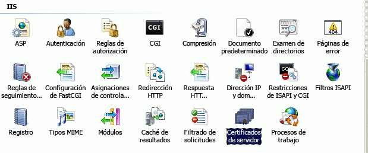
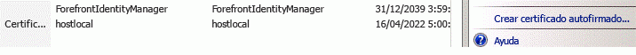

# Usar un sitio de Office 365 SharePoint para autorizar complementos hospedados por el proveedor en un sitio de SharePoint local
Use un sitio de Office 365 SharePoint para crear un entorno en el que pueda usar ACS para establecer confianza entre un complemento hospedado por el proveedor y una granja de servidores SharePoint 2013 local, de la misma forma que si estuviera desarrollando complementos para un sitio de Office 365 SharePoint.
## Requisitos previos para usar ACS con complementos hospedados por el proveedor en entornos locales
<a name="Prerequisites"> </a>

Asegúrese de que dispone de lo siguiente.
  
    
    

- Un entorno de desarrollo de SharePoint 2013 local. Vea  [Configurar un entorno de desarrollo en el nivel local para complementos para SharePoint](set-up-an-on-premises-development-environment-for-sharepoint-add-ins.md).
    
  
- Un sitio de Office 365 SharePoint. Si aún no tiene uno y desea instalar un entorno de desarrollo rápidamente, puede  [Configurar un entorno de desarrollo para complementos para SharePoint en Office 365](set-up-a-development-environment-for-sharepoint-add-ins-on-office-365.md).
    
  
-  [Visual Studio 2012](https://www.microsoft.com/es-es/download/details.aspx?id=30682) instalado remotamente o en el ordenador en el que instaló SharePoint 2013.
    
  
-  [Microsoft Office Developer Tools para Visual Studio 2012](https://msdn.microsoft.com/es-es/office/aa905340.aspx) .
    
  
- La edición de 64 bits del  [Ayudante para el inicio de sesión de Microsoft Online Services](http://www.microsoft.com/es-es/download/details.aspx?id=41950) instalada en el equipo en el que está instalado SharePoint 2013.
    
  
- El  [Módulo Microsoft Online Services para Windows PowerShell (64 bits)](http://go.microsoft.com/fwlink/p/?linkid=236297) instalado en el equipo en el que está instalado SharePoint 2013.
    
  

## Crear un certificado y convertirlo en el certificado del servicio de token de seguridad (STS) de la instalación local de SharePoint 2013
<a name="Certificate"> </a>

Deberá reemplazar el certificado predeterminado del servicio de token de seguridad (STS) de la instalación local de SharePoint 2013 con su propio certificado. En este artículo se ofrece un ejemplo de cómo crear y exportar un certificado de prueba mediante la opción **Crear certificado autofirmado** de IIS. También se puede usar un certificado comercial emitido por una entidad de certificación.
  
    
    
 [Primero, cree un archivo de certificado .pfx de prueba y, luego, un archivo de prueba .cer correspondiente](http://msdn.microsoft.com/es-es/library/windows/hardware/ff552299%28v=vs.85%29.aspx).
  
    
    
 [También se puede usar el programa de prueba MakeCert para generar un certificado X.509 de prueba](http://msdn.microsoft.com/es-es/library/ms537364%28VS.85%29.aspx).
  
    
    

### Para crear un archivo de certificado de prueba .pfx


1. En el administrador de IIS, seleccione el nodo  _NombreServidor_ en la vista de árbol de la izquierda.
    
  
2. Elija el icono **Certificados de servidor**, como se ve en la figura 1.
    
   **Figura 1. Opción Certificados de servidor de IIS**

  

     
  

  

  
3. Haga clic en el vínculo **Crear certificado autofirmado** en el conjunto de vínculos de la derecha, como se ve en la figura 2.
    
   **Figura 2. Vínculo Crear certificado autofirmado**

  

     
  

  

  
4. Asigne el nombre CertEjemploSTS al certificado y luego haga clic en **Aceptar**.
    
  
5. Haga clic con el botón secundario en el certificado y luego elija **Exportar**, como se ve en la figura 3.
    
   **Figura 3. Exportar un certificado de prueba**

  

     
  

  

  
6. Exporte el archivo a una ubicación que elija y asígnele una contraseña. En este ejemplo, la contraseña es **password**. En un entorno de producción, use una contraseña segura. Vea [Directrices para crear contraseñas seguras](http://msdn.microsoft.com/es-es/library/bb416446.aspx) y [Contraseñas seguras](http://msdn.microsoft.com/es-es/library/ms161962.aspx).
    
  

## Convertir el certificado en el certificado STS para la instalación local de SharePoint 2013
<a name="STSCertificate"> </a>

Ahora que ya tiene un certificado, va a convertirlo en el certificado STS para la granja de servidores de SharePoint local.
  
    
    
Abra Shell de administración de SharePoint como administrador y ejecute este script de Windows PowerShell.
  
    
    


```

$certPrKPath = "c:\\location of your .pfx file"
$certPassword = "password"
$stsCertificate = New-Object System.Security.Cryptography.X509Certificates.X509Certificate2 $certPrKPath, $certPassword, 20
Set-SPSecurityTokenServiceConfig -ImportSigningCertificate $stsCertificate -confirm:$false

```


> **NOTA**
> En el documento  [Configuración de un entorno híbrido unidireccional con SharePoint Server 2013 y Office 365](http://download.microsoft.com/download/6/4/4/644BA525-96CB-4739-B08F-18949A9BDADC/sps-2013-config-one-way-hybrid-environment.docx), disponible para su descarga en la  [página de recursos híbridos de SharePoint 2013](http://www.microsoft.com/es-es/download/details.aspx?id=35593), se explica en detalle cómo reemplazar el certificado STS predeterminado de la granja de servidores local con un certificado procedente de una entidad de certificación conocida o con un certificado autofirmado. 
  
    
    


## Configurar la instalación local de SharePoint 2013 para usar ACS
<a name="ConnectAAD"> </a>

La figura 4 muestra los cuatro pasos para habilitar las conexiones necesarias dentro de la arquitectura general de un complemento hospedado por el proveedor que se ejecuta en un sitio local. También muestra el flujo de tokens de OAuth cuando el complemento está en ejecución.
  
    
    

**Figura 4. Hacer que ACS funcione con una instalación local de SharePoint a través de un sitio de Office 365 SharePoint**

  
    
    

  
    
    

  
    
    

  
    
    

1. Cree un proxy de ACS en la granja de servidores de SharePoint 2013 local.
    
  
2. Instale el certificado de firma del servidor local en su arrendamiento de Office 365.
    
  
3. Agregue los nombres de dominio completos de los sitios en la granja de servidores de SharePoint 2013 donde desea ejecutar complementos a la colección de nombres principal del servicio en su arrendamiento de Office 365.
    
  
4. Cree un proxy de administración de complementos en su granja de servidores de SharePoint 2013.
    
  
La función que se incluye más abajo realiza todo el trabajo para configurar el sitio de SharePoint 2013 local para usar ACS. También puede usar esta función para llevar a cabo algunas tareas de limpieza si necesita quitar algunas configuraciones anteriores. Hay varias formas de ejecutar la función en PowerShell. El siguiente es uno de los métodos:
  
    
    

  
    
    

1. En el servidor de SharePoint local, copie el código de la función en un archivo de texto y guárdelo con el nombre MySharePointFunctions.psm1 en alguna de las siguientes carpetas (no en ambas). Es posible que deba crear partes de la ruta de acceso si incluye carpetas que aún no existen. Observe que, en ambos casos, la carpeta inferior de la ruta de acceso tiene que tener el mismo nombre que el archivo.
    
    > **SUGERENCIA**
      > El archivo se debe guardar en formato ANSI, no en UTF-8. PowerShell podría generar errores de sintaxis si carga un archivo que no tiene un formato ANSI. El Bloc de notas de Windows lo guarda de forma predeterminada como ANSI. Si usa cualquier otro editor para guardar el archivo, asegúrese que lo guarda como ANSI. 

  -  `C:\\users\\username\\documents\\windowspowershell\\modules\\MySharePointFunctions`, donde  _username_ es el administrador de la granja de servidores que ejecutará el archivo.
    
  
  -  `C:\\windows\\system32\\windowspowershell\\V1.0\\modules\\MySharePointFunctions`
    
  
2. Abra Shell de administración de SharePoint como administrador y ejecute el siguiente cmdlet para comprobar que el módulo MySharePointFunctions está en la lista.
    
  ```
  
Get-Module -listavailable
  ```

3. Ejecute el siguiente cmdlet para importar el módulo.
    
  ```
  Import-Module MySharePointFunctions
  ```

4. Ejecute el siguiente cmdlet para comprobar que la función Connect-SPFarmToAAD aparece en la lista como parte del módulo:
    
  ```
  Get-Command -module MySharePointFunctions
  ```

5. Ejecute el siguiente cmdlet para comprobar que la función Connect-SPFarmToAAD está cargada.
    
  ```
  ls function:\\ | where {$_.Name -eq "Connect-SPFarmToAAD"}
  ```

6. Ejecute la función  `Connect-SPFarmToAAD`. Asegúrese de proporcionar los parámetros requeridos y cualquier parámetro opcional que se aplique a su entorno de desarrollo. Vea la siguiente sección para obtener detalles y ejemplos.
    
  

  
    
    

### Parámetros de la función Connect-SPFarmToAAD
<a name="parameters"> </a>


|**Parámetro**|**Valor**|
|:-----|:-----|
| `-AADDomain` (obligatorio) <br/> |El dominio *.onmicrosoft.com que creó cuando se registró para su sitio de Office 365 ( _suDominioPersonalizado_.onmicrosoft.com). Cuando el script le solicite su autenticación, use el nombre de usuario y la contraseña que creó para este dominio:  _nombreDeUsuario_@ _suDominioPersonalizado_.onmicrosoft.com.  <br/> |
| `-SharePointOnlineUrl` (obligatorio) <br/> |La dirección URL de su sitio de Office 365 SharePoint ( _https://suDominioPersonalizado_.sharepoint.com). Observe que el dominio primario  *no es*  onmicrosoft.com. <br/> |
| `-SharePointWeb` (requerido a veces) <br/> |La dirección URL completa (incluido el protocolo) de la aplicación web de SharePoint local en la que ejecutará los complementos hospedados por el proveedor. Esta función solo agrega una aplicación web de SharePoint de su granja de servidores local a ACS. Si no especifica un valor para este parámetro, el script selecciona la primera aplicación web de la granja de servidores. Si usa una colección de sitios de nombres de host (HNSC) que se puede definir con un comodín (como  _http://*.contoso.com_), puede usar esa cadena como el valor del parámetro. Si la aplicación web tiene una asignación alternativa de acceso (AAM) para la zona de Internet, debe usar la dirección URL de AAM para este parámetro. Si la aplicación web de SharePoint no está configurada para HTTPS, tiene que usar HTTP como el protocolo y  *debe usar el modificador -AllowOverHttp (vea más abajo en la tabla).*  <br/> Si desea ejecutar complementos hospedados por el proveedor que usen ACS en más aplicaciones web de la granja de servidores, deberá agregarlas a la colección de nombres principales del servicio. El script de Windows PowerShell incluido después de la función  `Connect-SPFarmToAAD` muestra cómo agregar todas las aplicaciones web de la granja de servidores a la colección de nombres principales del servicio. <br/> |
| `-AllowOverHttp` (opcional) <br/> |Use este modificador si está trabajando con un entorno de desarrollo y no desea usar SSL con los complementos. Debe usar este modificador si la aplicación web de SharePoint no está configurada para HTTPS.  <br/> |
| `-O365Credentials` (opcional) <br/> |El primer carácter es una "O" en mayúsculas, no un cero. Si debe ejecutar repetidamente el script con motivos de depuración, este modificador le evita tener que escribir manualmente su nombre y contraseña de O365 cada vez. Antes de poder usar este parámetro, debe crear el objeto de credenciales que le asignará con estos cmdlets:  <br/> ```$User = "username@yourcustomdomain.onmicrosoft.com"$PWord = ConvertTo-SecureString -String "the_password" -AsPlainText -Force$Credential = New-Object -TypeName System.Management.Automation.PSCredential -ArgumentList $User, $PWord```Use  `$Credential` como el valor del parámetro `-O365Credentials`.  <br/> |
| `-Verbose` (opcional) <br/> |Este modificador genera comentarios más detallados, lo que podría resultar de utilidad si la función no funciona y debe volver a ejecutarla para depurarla.  <br/> |
| `-RemoveExistingACS` (opcional) <br/> |Use este modificador si está reemplazando una conexión existente a Active Directory de Microsoft Azure. Quita un proxy de ACS existente si ya ha creado uno en la granja de servidores.  <br/> |
| `-RemoveExistingSTS` (opcional) <br/> |Use este modificador si está reemplazando una conexión existente a Active Directory de Microsoft Azure. Quita un emisor de tokens de seguridad existente que permanecía de una conexión anterior a ACS.  <br/> |
| `-RemoveExistingSPOProxy` (opcional) <br/> |Use este modificador si está reemplazando una conexión existente a Active Directory de Microsoft Azure. Quita un proxy de administración de complementos existente si ya ha creado uno en la granja de servidores.  <br/> |
| `-RemoveExistingAADCredentials` (opcional) <br/> |Use este modificador si está reemplazando el sitio de Office 365 SharePoint.  <br/> |
   
A continuación se incluyen ejemplos:
  
    
    

```

Connect-SPFarmToAAD -AADDomain 'MyO365Domain.onmicrosoft.com' -SharePointOnlineUrl https://MyO365Domain.sharepoint.com

Connect-SPFarmToAAD -AADDomain 'MyO365Domain.onmicrosoft.com' -SharePointOnlineUrl https://MyO365Domain.sharepoint.com -SharePointWeb https://fabrikam.com

Connect-SPFarmToAAD -AADDomain 'MyO365Domain.onmicrosoft.com' -SharePointOnlineUrl https://MyO365Domain.sharepoint.com -SharePointWeb http://northwind.com -AllowOverHttp

Connect-SPFarmToAAD -AADDomain 'MyO365Domain.onmicrosoft.com' -SharePointOnlineUrl https://MyO365Domain.sharepoint.com -SharePointWeb http://northwind.com -AllowOverHttp -RemoveExistingACS -RemoveExistingSTS -RemoveExistingSPOProxy -RemoveExistingAADCredentials

```


### Script de la función Connect-SPFarmToAAD
<a name="function"> </a>


```

function Connect-SPFarmToAAD {
param(
    [Parameter(Mandatory)][String]   $AADDomain,
    [Parameter(Mandatory)][String]   $SharePointOnlineUrl,
    #Specify this parameter if you don't want to use the default SPWeb returned
    [Parameter()][String]            $SharePointWeb,
    [Parameter()][System.Management.Automation.PSCredential] $O365Credentials,
    #Use these switches if you're replacing an existing connection to AAD.
    [Parameter()][Switch]            $RemoveExistingACS,
    [Parameter()][Switch]            $RemoveExistingSTS,
    [Parameter()][Switch]            $RemoveExistingSPOProxy,
    #Use this switch if you're replacing the Office 365 SharePoint site.
    [Parameter()][Switch]            $RemoveExistingAADCredentials,
    #Use this switch if you don't want to use SSL when you launch your app.
    [Parameter()][Switch]            $AllowOverHttp
)
    #Prompt for credentials right away.
    if (-not $O365Credentials) {
        $O365Credentials = Get-Credential -Message "Admin credentials for $AADDomain"
    }
    Add-PSSnapin Microsoft.SharePoint.PowerShell
    #Import the Microsoft Online Services Sign-In Assistant.
    Import-Module -Name MSOnline
    #Import the Microsoft Online Services Module for Windows Powershell.
    Import-Module MSOnlineExtended -force -verbose 
    #Set values for Constants.
    New-Variable -Option Constant -Name SP_APPPRINCIPALID -Value '00000003-0000-0ff1-ce00-000000000000' | Out-Null
    New-Variable -Option Constant -Name ACS_APPPRINCIPALID -Value '00000001-0000-0000-c000-000000000000' | Out-Null
    New-Variable -Option Constant -Name ACS_APPPROXY_NAME -Value ACS
    New-Variable -Option Constant -Name SPO_MANAGEMENT_APPPROXY_NAME -Value 'SPO Add-in Management Proxy'
    New-Variable -Option Constant -Name ACS_STS_NAME -Value ACS-STS
    New-Variable -Option Constant -Name AAD_METADATAEP_FSTRING -Value 'https://accounts.accesscontrol.windows.net/{0}/metadata/json/1'
    New-Variable -Option Constant -Name SP_METADATAEP_FSTRING -Value '{0}/_layouts/15/metadata/json/1'
    #Get the default SPWeb from the on-premises farm if no $SharePointWeb parameter is specified.
    if ([String]::IsNullOrEmpty($SharePointWeb)) {
        $SharePointWeb = Get-SPSite | Select-Object -First 1 | Get-SPWeb | Select-Object -First 1 | % Url
    }

    #Configure the realm ID for local farm so that it matches the AAD realm.
    $ACSMetadataEndpoint = $AAD_METADATAEP_FSTRING -f $AADDomain
    $ACSMetadata = Invoke-RestMethod -Uri $ACSMetadataEndpoint
    $AADRealmId = $ACSMetadata.realm

    Set-SPAuthenticationRealm -ServiceContext $SharePointWeb -Realm $AADRealmId
    
    $LocalSTS = Get-SPSecurityTokenServiceConfig
    $LocalSTS.NameIdentifier = '{0}@{1}' -f $SP_APPPRINCIPALID,$AADRealmId
    $LocalSTS.Update()

    #Allow connections over HTTP if the switch is specified.
    if ($AllowOverHttp.IsPresent -and $AllowOverHttp -eq $True) {
        $serviceConfig = Get-SPSecurityTokenServiceConfig
        $serviceConfig.AllowOAuthOverHttp = $true
        $serviceConfig.AllowMetadataOverHttp = $true
        $serviceConfig.Update()
    }

    #Step 1: Set up the ACS proxy in the on-premises SharePoint farm. Remove the existing ACS proxy
    #if the switch is specified.
    if ($RemoveExistingACS.IsPresent -and $RemoveExistingACS -eq $True) {
        Get-SPServiceApplicationProxy | ? DisplayName -EQ $ACS_APPPROXY_NAME | Remove-SPServiceApplicationProxy -RemoveData -Confirm:$false
    }
    if (-not (Get-SPServiceApplicationProxy | ? DisplayName -EQ $ACS_APPPROXY_NAME)) {
        $AzureACSProxy = New-SPAzureAccessControlServiceApplicationProxy -Name $ACS_APPPROXY_NAME -MetadataServiceEndpointUri $ACSMetadataEndpoint -DefaultProxyGroup
    }

    #Remove the existing security token service if the switch is specified.
    if ($RemoveExistingSTS.IsPresent) {
        Get-SPTrustedSecurityTokenIssuer | ? Name -EQ $ACS_STS_NAME | Remove-SPTrustedSecurityTokenIssuer -Confirm:$false
    }
    if (-not (Get-SPTrustedSecurityTokenIssuer | ? DisplayName -EQ $ACS_STS_NAME)) {
        $AzureACSSTS = New-SPTrustedSecurityTokenIssuer -Name $ACS_STS_NAME -IsTrustBroker -MetadataEndPoint $ACSMetadataEndpoint
    }

    #Update the ACS Proxy for OAuth authentication.
    $ACSProxy = Get-SPServiceApplicationProxy | ? Name -EQ $ACS_APPPROXY_NAME
    $ACSProxy.DiscoveryConfiguration.SecurityTokenServiceName = $ACS_APPPRINCIPALID
    $ACSProxy.Update()

    #Retrieve the local STS signing key from JSON metadata.
    $SPMetadata = Invoke-RestMethod -Uri ($SP_METADATAEP_FSTRING -f $SharePointWeb)
    $SPSigningKey = $SPMetadata.keys | ? usage -EQ "Signing" | % keyValue
    $CertValue = $SPSigningKey.value
    
    #Connect to Office 365.
    Connect-MsolService -Credential $O365Credentials
    #Remove existing connection to an Office 365 SharePoint site if the switch is specified.
    if ($RemoveExistingAADCredentials.IsPresent -and $RemoveExistingAADCredentials -eq $true) {
        $msolserviceprincipal = Get-MsolServicePrincipal -AppPrincipalId $SP_APPPRINCIPALID
        [Guid[]] $ExistingKeyIds = Get-MsolServicePrincipalCredential -ObjectId $msolserviceprincipal.ObjectId -ReturnKeyValues $false | % {if ($_.Type -ne "Other") {$_.KeyId}}
        Remove-MsolServicePrincipalCredential -AppPrincipalId $SP_APPPRINCIPALID -KeyIds $ExistingKeyIds
    }
    #Step 2: Upload the local STS signing certificate
    New-MsolServicePrincipalCredential -AppPrincipalId $SP_APPPRINCIPALID -Type Asymmetric -Value $CertValue -Usage Verify

    #Step 3: Add the service principal name of the local web application, if necessary.
    $indexHostName = $SharePointWeb.IndexOf('://') + 3
    $HostName = $SharePointWeb.Substring($indexHostName)
    $NewSPN = '{0}/{1}' -f $SP_APPPRINCIPALID, $HostName
    $SPAppPrincipal = Get-MsolServicePrincipal -AppPrincipalId $SP_APPPRINCIPALID
    if ($SPAppPrincipal.ServicePrincipalNames -notcontains $NewSPN) {
        $SPAppPrincipal.ServicePrincipalNames.Add($NewSPN)
        Set-MsolServicePrincipal -AppPrincipalId $SPAppPrincipal.AppPrincipalId -ServicePrincipalNames $SPAppPrincipal.ServicePrincipalNames
    }

    #Remove the existing SharePoint Online proxy if the switch is specified.
    if ($RemoveExistingSPOProxy.IsPresent -and $RemoveExistingSPOProxy -eq $True) {
        Get-SPServiceApplicationProxy | ? DisplayName -EQ $SPO_MANAGEMENT_APPPROXY_NAME | Remove-SPServiceApplicationProxy -RemoveData -Confirm:$false
    }
    #Step 4: Add the SharePoint Online proxy
    if (-not (Get-SPServiceApplicationProxy | ? DisplayName -EQ $SPO_MANAGEMENT_APPPROXY_NAME)) {
        $spoproxy = New-SPOnlineApplicationPrincipalManagementServiceApplicationProxy -Name $SPO_MANAGEMENT_APPPROXY_NAME -OnlineTenantUri $SharePointOnlineUrl -DefaultProxyGroup
    }  
}
```


### Configurar el complemento y la aplicación web de SharePoint para la Tienda Office
<a name="function"> </a>

Existe un paso de configuración opcional que los administradores de granjas de servidores deberían llevar a cabo en entornos de producción si quieren que los usuarios puedan instalar complementos hospedados por el proveedor que usen ACS desde la Tienda Office (no tiene ninguna utilidad en el entorno de desarrollo de SharePoint, a menos que planee instalar complementos que usen ACS desde la tienda en ese entorno). El siguiente cmdlet lo hace posible. Este código se puede agregar a la función de arriba.
  
    
    

```

New-SPMarketplaceWebServiceApplicationProxy -Name "ApplicationIdentityDataWebServiceProxy" -ServiceEndpointUri "https://oauth.sellerdashboard.microsoft.com/ApplicationIdentityDataWebService.svc" -DefaultProxyGroup

```

Al producir aplicaciones web de SharePoint también se recomienda activar la característica **Complementos que necesitan extremos accesibles con conexión a Internet** una vez que se hayan completado los pasos de configuración mencionados. (Vea las instrucciones a continuación). Esta característica no hace nada en realidad. Simplemente sirve como marca que indica a la Tienda Office que los complementos hospedados por el proveedor que usan ACS se pueden instalar en sitios web de la aplicación web de SharePoint.
  
    
    
Este sistema puede tener implicaciones para el manifiesto del complemento de la Complemento de SharePoint. Si planea venderlo a través de la tienda, se recomienda agregar el siguiente **AppPrerequiste** a la sección **AppPrerequisites** del manifiesto del complemento:
  
    
    


```

<AppPrerequisite Type="Feature" ID="{7877bbf6-30f5-4f58-99d9-a0cc787c1300}" />
```

El efecto del requisito previo es que, cuando los usuarios exploren la tienda desde una granja local de SharePoint, el complemento se volverá atenuado y no instalable cuando la aplicación web primaria de SharePoint no tenga habilitada la característica **Complementos que necesitan extremos accesibles con conexión a Internet**. Esto garantiza que no recibirá quejas por parte de los clientes que instalen el complemento en un sitio web local de SharePoint y se den cuenta de que no funciona.
  
    
    
Existen dos formas de habilitar la característica. La primera es ejecutar el siguiente cmdlet de PowerShell (que se puede agregar al final de la función anterior) en cualquier servidor de SharePoint:
  
    
    


```
Enable-SPFeature -identity "7877bbf6-30f5-4f58-99d9-a0cc787c1300" -Url http://domain_of_the_SharePoint_web_application
```

La otra forma de habilitar la característica es realizar los siguientes pasos en Administración central:
  
    
    

1. En **Administración central de SharePoint**, navegue a **Administración de aplicaciones | Administrar aplicaciones web**.
    
  
2. En la página **Administrar aplicaciones web**, seleccione la aplicación web que quiera cambiar.
    
  
3. En la cinta, haga clic en **Administrar características**.
    
  
4. En la lista de características, junto a **Complementos que necesitan extremos accesibles con conexión a Internet**, haga clic en **Activar**.
    
  
5. Haga clic en **Aceptar**.
    
  

  
    
    

### Configurar más aplicaciones web de SharePoint dentro de la granja
<a name="function"> </a>

Si tiene aplicaciones web adicionales en la granja de servidores de SharePoint y desea ejecutar complementos hospedados por el proveedor que usan confianza de ACS en ellos, puede usar este script de Windows PowerShell (en Shell de administración de SharePoint) para agregarlos a la colección de nombres principales de servicio.
  
    
    

```
$SPAppPrincipal = Get-MsolServicePrincipal -AppPrincipalId 00000003-0000-0ff1-ce00-000000000000
$id = "00000003-0000-0ff1-ce00-000000000000/"

Get-SPWebApplication | ForEach-Object {
    $hostName = $_.Url.substring($_.Url.indexof("//") + 2)
    $hostName = $hostName.Remove($hostName.Length - 1, 1)

    $NewSPN = $id + $hostName

    Write-Host "Adding SPN for" $NewSPN

    if ($SPAppPrincipal.ServicePrincipalNames -notcontains $NewSPN) {
       $SPAppPrincipal.ServicePrincipalNames.Add($NewSPN)
       Set-MsolServicePrincipal -AppPrincipalId $SPAppPrincipal.AppPrincipalId -ServicePrincipalNames $SPAppPrincipal.ServicePrincipalNames
    }
}

```


## Pasos siguientes
<a name="CreateApp"> </a>

Siga los pasos en  [Empezar a crear complementos hospedados en proveedor para SharePoint](get-started-creating-provider-hosted-sharepoint-add-ins.md) para crear un sencillo complemento "hola a todos" hospedado por el proveedor que use ACS como emisor de tokens.
  
    
    

## Recursos adicionales
<a name="bk_addresources"> </a>


-  [Autorización y autenticación de complementos de SharePoint](authorization-and-authentication-of-sharepoint-add-ins.md)
    
  
