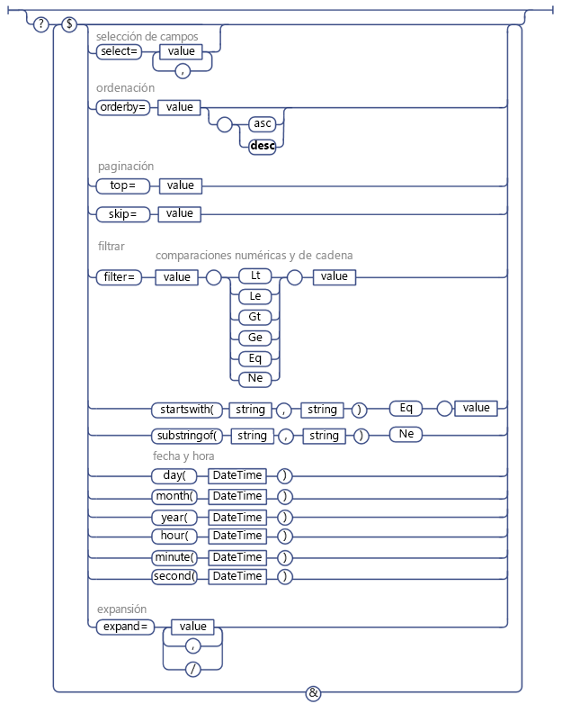

# Usar operaciones de consulta de OData en solicitudes REST de SharePoint
Aprenda a usar una amplia variedad de operadores de cadenas de consultas OData para seleccionar, filtrar y ordenar los datos solicitados del servicio REST de SharePoint.
 **Antes de comenzar**

-  [Introducción al servicio REST para SharePoint 2013](get-to-know-the-sharepoint-2013-rest-service.md)

-  [Navegar por la estructura de datos de SharePoint representada en el servicio REST](navigate-the-sharepoint-data-structure-represented-in-the-rest-service.md)

-  [Determinar los URI de extremo de REST de SharePoint](determine-sharepoint-rest-service-endpoint-uris.md)

El servicio REST de SharePoint admite una amplia variedad de operadores de cadenas de consultas OData que permiten seleccionar, filtrar y ordenar los datos solicitados.

> **SUGERENCIA**
> El servicio REST de SharePoint Online (y SharePoint 2016 local o versiones posteriores) admite la combinación de varias solicitudes en una sola llamada al servicio mediante el uso de la opción de consulta  `$batch` de OData. Para obtener información detallada y vínculos a los ejemplos de código, vea [Realizar solicitudes de lote con las API de REST](make-batch-requests-with-the-rest-apis.md). 

## Seleccionar los campos para devolver

Use la opción de consulta  [$select](http://www.odata.org/documentation/odata-version-2-0/uri-conventions#SelectSystemQueryOption) para especificar los campos que se devolverán para una lista, un elemento de lista, u otro objeto de SharePoint específicos y representados por un conjunto de entidades. Puede usar `$select=*` para devolver todos los campos disponibles.

> **NOTA**
> En general, si no especifica la opción de consulta  `$select`, el servicio REST devuelve todos los campos disponibles de forma predeterminada. Pero, en unos pocos casos, algunos objetos de SharePoint incluyen propiedades que consumen muchos recursos en su recuperación; para optimizar el rendimiento del servicio REST, estas propiedades no se incluyen en la consulta predeterminada, y es necesario solicitarlas explícitamente.
> Por ejemplo, la propiedad **SPWeb.EffectiveBasePermissions** no se devuelve de forma predeterminada, y es necesario solicitarla explícitamente con la opción de consulta `$select`. 

También, puede especificar que la solicitud devuelva campos proyectados de otras listas y los valores de búsquedas. Para ello, especifique el nombre de campo en las opciones de consulta  `$select` y `$expand`. Por ejemplo:

 `http://server/site/_api/web/lists('guid')/items?$select=Title,Products/Name&amp;$expand=Products/Name`

No se admiten la expansión y selección masivas de elementos relacionados.

## Seleccionar los elementos para devolver

Use la opción de consulta  [$filter](http://www.odata.org/documentation/odata-version-2-0/uri-conventions#FilterSystemQueryOption) para seleccionar los elementos que se devolverán. En la sección [Operadores de consultas de OData compatibles con el servicio REST de SharePoint](#bk_supported) enumera las opciones y funciones de comparación de consultas de filtros que puede usar con el servicio REST de SharePoint.

## Consulta para campos de búsqueda de valores únicos

Los campos de búsqueda de valores únicos se representan con dos campos separados en el servicio REST de SharePoint: un campo representa al valor de campo real, y otro representa al nombre del campo. Puede hacer consultas con el valor del campo de búsqueda tal como lo haría con cualquier otro campo de ese tipo de datos. Por ejemplo, si el valor del campo de búsqueda es una cadena, puede usar opciones de comparación de cadenas en la consulta.

## Consulta para usuarios

En el servicio REST de SharePoint, los usuarios están representados con el nombre (visualización) de usuario fácil de recordar, y no sus alias o combinación dominio\\alias. Por lo tanto, construya consultas de usuario con los nombres de usuario fáciles de recordar.

> **NOTA**
> No se admiten las consultas de usuario basadas en pertenencia.
> No se admite el uso del operador **Current** para hacer consultas con el Id. del usuario actual.

## Consulta de usuarios y campos de búsqueda de varios valores

Dado que los campos de búsqueda de varios valores son devueltos como una cadena de varios valores, no existe una manera de consultarlos (por ejemplo, no se admite el equivalente de un elemento **Includes** o un elemento **NotIncludes**).

## Ordenar elementos devueltos

Use la opción de consulta  [$orderby](http://www.odata.org/documentation/odata-version-2-0/uri-conventions#OrderBySystemQueryOption) para especificar cómo ordenar los elementos en su conjunto de devolución de consultas. Para ordenar según varios campos, especifique una lista de campos separada por comas. También puede especificar si los elementos se ordenarán de manera ascendente o descendente al agregar la palabra clave **asc** o **desc** a su consulta.

## Pasar de una página a otra en elementos devueltos

Use las opciones de consulta  [$top](http://www.odata.org/documentation/odata-version-2-0/uri-conventions#TopSystemQueryOption) y [$skiptoken](http://msdn.microsoft.com/library/dd942121.aspx) para seleccionar un subconjunto de los elementos que, de lo contrario, devolvería la consulta.

> **NOTA**
> La opción de consulta $skip no funciona con consultas para elementos de lista de SharePoint. 

La opción  `$top` le permite seleccionar para devolver los primeros *n*  elementos del conjunto de devolución. Por ejemplo, la siguiente URI solicita que realmente se devuelvan solo los primeros diez elementos del conjunto de devolución posible:

 `http://server/site/_api/web/lists('<guid>')/items$top=10`

La opción $skiptoken le permite omitir elementos hasta que se alcanza el elemento especificado y devolver el resto.

 `$skiptoken=Paged=TRUE&amp;p_ID=5`

> **NOTA**
> Cuando use estas opciones de consulta, tenga en cuenta que el paginado en OData es ordinal. Por ejemplo, supongamos que está implementando un botón de página siguiente para mostrar los elementos de lista de SharePoint. Usa el servicio REST para permitir que el botón devuelva los elementos 1 a 20 al hacer clic en ellos, después los elementos 21 a 40 y así sucesivamente. Pero supongamos que otro usuario elimina los elementos 4 y 18 entre clics del botón siguiente. En tal caso, se restablece el posicionamiento ordinal de los elementos restantes, y la visualización de los elementos 21 a 40 omite dos elementos. 

## Operadores de consultas de OData compatibles con el servicio REST de SharePoint

|**Admitido**|**No admitido**|
|:-----|:-----|
|**Comparaciones numéricas**    Lt    Le    Gt    Ge    Eq    Ne   | Operadores aritméticos           (Add, Sub, Mul, Div, Mod)    Funciones matemáticas básicas          (round, floor, ceiling)    |
|**Comparaciones de cadenas**    startsWith    substringof    Eq    Ne   | endsWith    reemplazar    substring    tolower    toupper    trim    concat   |
|**Funciones de fecha y hora**    day()    month()    year()    hour()    minute()    second()   | Operador DateTimeRangesOverlap    Consultar si la hora de una fecha cae dentro de un patrón de horas de fechas recurrente.   |
 
En la siguiente figura, se muestran las opciones de consultas OData admitidas.

**Opciones de consultas OData admitidas**

## Recursos adicionales

-  [Introducción al servicio REST para SharePoint 2013](get-to-know-the-sharepoint-2013-rest-service.md)

-  [Procedimiento para realizar operaciones básicas con extremos REST de SharePoint 2013](complete-basic-operations-using-sharepoint-2013-rest-endpoints.md)

-  [Trabajar con listas y elementos de lista con REST](working-with-lists-and-list-items-with-rest.md)

-  [Trabajar con carpetas y archivos con REST](working-with-folders-and-files-with-rest.md)

-  [Navegar por la estructura de datos de SharePoint representada en el servicio REST](navigate-the-sharepoint-data-structure-represented-in-the-rest-service.md)

-  [Determinar los URI de extremo de REST de SharePoint](determine-sharepoint-rest-service-endpoint-uris.md)

-  [API de REST, extremos y ejemplos de SharePoint 2013](02128c70-9d27-4388-9374-a11bce68fdb8.md)

