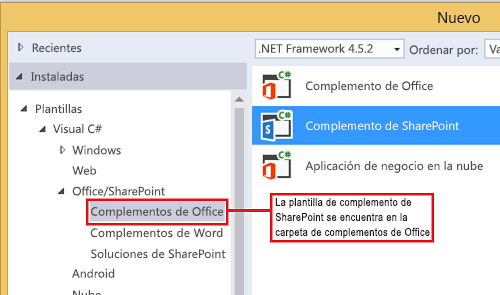

# Usar el control cromo de cliente en complementos de SharePoint
Usar el control de cromo en los complementos de SharePoint 2013.
El nuevo control de cromo en SharePoint 2013 le permite usar el estilo de los encabezados de un sitio específico de SharePoint en el complemento sin necesidad de registrar una biblioteca de servidores ni de usar una herramienta o tecnología específicas. Para usar esta funcionalidad, debe registrar una biblioteca JavaScript de SharePoint mediante una etiqueta de <script>. Puede proporcionar marcadores mediante un elemento **div** HTML y establecer las configuraciones necesarias con las opciones disponibles. El control hereda su aspecto del sitio web de SharePoint especificado.
  
    
    


## Requisitos previos para usar los ejemplos de este artículo
<a name="SP15Usechromecontrol_Prereq"> </a>

Para seguir los pasos de este ejemplo, necesita lo siguiente:
  
    
    

- Visual Studio 2015
    
  
- Un entorno de desarrollo de SharePoint 2013 (es necesario el aislamiento de complementos para entornos locales)
    
  
En este enlace encontrará información sobre cómo configurar un entorno de desarrollo que se ajuste a sus necesidades:  [Empezar a crear aplicaciones para Office y SharePoint](http://msdn.microsoft.com/library/187f8c8c-1b15-471c-80b5-69a40e67deea%28Office.15%29.aspx).
  
    
    

### Conceptos básicos necesarios antes de usar el control cromo

En la tabla siguiente, se ofrece una lista de artículos que le resultarán de utilidad para familiarizarse con los conceptos propios de un entorno que usa el control cromo.
  
    
    

**Tabla 1. Conceptos básicos para usar el control cromo**


|**Título del artículo**|**Descripción**|
|:-----|:-----|
| [Complementos de SharePoint](sharepoint-add-ins.md) <br/> |Conozca el nuevo modelo de complemento en SharePoint 2013 que le permitirá crear complementos pequeños y de fácil uso para los usuarios finales.  <br/> |
| [Diseño de la experiencia de usuario para aplicaciones en SharePoint 2013](ux-design-for-sharepoint-add-ins.md) <br/> |Conozca las diferentes opciones y alternativas para la experiencia de usuario (UX) destinadas el desarrollo de Complementos de SharePoint.  <br/> |
| [Hospedar webs, webs de complementos y componentes de SharePoint en SharePoint 2013](host-webs-add-in-webs-and-sharepoint-components-in-sharepoint-2013.md) <br/> |Conozca las diferencias entre sitios web de host y sitios web de complemento. Sepa qué componentes de SharePoint 2013 se pueden incluir en una Complemento de SharePoint, qué componentes se implementan en el sitio web de host, qué componentes se implementan en el sitio web del complemento y cómo se implementa el sitio web del complemento en un dominio aislado.  <br/> |
   

## Ejemplo de código: Use the chrome control in your cloud-hosted add-in
<a name="SP15Usechromecontrol_Codeexample"> </a>

Un complemento hospedado en la nube incluye al menos un componente remoto. Para obtener más información, consulte  [Elegir patrones para desarrollar y hospedar un complemento para SharePoint](choose-patterns-for-developing-and-hosting-your-sharepoint-add-in.md). Para usar el control de cromo en el complemento hospedado en la nube, siga los pasos a continuación:
  
    
    

1. Cree el proyecto web de Complemento de SharePoint y el proyecto web remoto.
    
  
2. Envíe las opciones de configuración en la cadena de consultas.
    
  
3. Agregue una página web al proyecto web.
    
  
La Figura 1 ilustra una página web remota con el control cromo.
  
    
    

**Figura 1. Página web remota con el control cromo**

  
    
    

  
    
    

  
    
    

### Para crear el proyecto web de Complemento de SharePoint y el proyecto web remoto


1. Abra Visual Studio 2015 como administrador. (Para ello, haga clic con el botón derecho en el icono de Visual Studio 2015 en el menú **Inicio** y elija **Ejecutar como administrador**).
    
  
2. Cree un nuevo proyecto con la plantilla **Complemento de SharePoint**.
    
    En la Figura 2 se muestra la ubicación de la plantilla **Complemento de SharePoint** en Visual Studio 2015, en **Plantillas**, **Visual C#**, **Office/SharePoint**, **Complementos de Office**.
    

   **Figura 2. Plantilla de Visual Studio de Complemento de SharePoint**

  

     
  

  

  
3. Proporcione la dirección URL del sitio web de SharePoint que desee usar para la depuración.
    
  
4. Seleccione **Hospedado por el proveedor** como opción de hospedaje para el complemento. Puede ver un ejemplo de código hospedado en SharePoint en [SharePoint-Add-in-JSOM-BasicDataOperations](https://github.com/OfficeDev/SharePoint-Add-in-JSOM-BasicDataOperations).
    
    Una vez haya finalizado el asistente, la estructura en el **Explorador de soluciones** debería asemejarse a la que aparece en la Figura 3.
    

   **Figura 3. Complemento para proyectos de SharePoint en el Explorador de soluciones**

  

     
  

  

  

### Para enviar las opciones de la configuración predeterminada en la cadena de consultas


1. Abra el archivo Appmanifest.xml en el editor de manifiestos.
    
  
2. Agregue el token **{StandardTokens}** y un parámetro _SPHostTitle_ adicional a la cadena de consultas. La Figura 4 muestra el editor de manifiestos con los parámetros de la cadena de consultas configurados.
    
   **Figura 4. Editor de manifiestos con los parámetros de la cadena de consultas para el control cromo**

  

     
  

    El control cromo adopta automáticamente los valores de la cadena de consultas:
    
  - **SPHostUrl**
    
  
  - **SPHostTitle**
    
  
  - **SPAppWebUrl**
    
  
  - **SPLanguage**
    
  

    **{StandardTokens}** incluye **SPHostUrl** y **SPAppWebUrl**.
    
  

### Para agregar una página que use el control cromo en el proyecto web


1. Haga clic con el botón secundario en el proyecto web y agregue un formulario web nuevo.
    
  
2. Copie el siguiente marcado y péguelo en la página ASPX. El marcado realiza las siguientes tareas:
    
  - Carga la biblioteca AJAX desde la red de entrega de contenido (CDN) de Microsoft.
    
  
  - Carga la biblioteca jQuery desde la CDN de Microsoft.
    
  
  - Carga el archivo SP.UI.Controls.js mediante la función **getScript** de jQuery.
    
  
  - Define una función de devolución de llamada para el evento **onCssLoaded**.
    
  
  - Prepara las opciones para el control cromo.
    
  
  - Inicializa el control cromo.
    
  

  ```HTML
  
<!DOCTYPE html>
<html xmlns="http://www.w3.org/1999/xhtml">
<head>
    <title>Chrome control host page</title>
    <script 
        src="//ajax.aspnetcdn.com/ajax/4.0/1/MicrosoftAjax.js" 
        type="text/javascript">
    </script>
    <script 
        type="text/javascript" 
        src="//ajax.aspnetcdn.com/ajax/jQuery/jquery-1.7.2.min.js">
    </script>      
    <script 
        type="text/javascript"
        src="ChromeLoader.js">
    </script>
<script type="text/javascript">
"use strict";

var hostweburl;

//load the SharePoint resources
$(document).ready(function () {
    //Get the URI decoded URL.
    hostweburl =
        decodeURIComponent(
            getQueryStringParameter("SPHostUrl")
    );

    // The SharePoint js files URL are in the form:
    // web_url/_layouts/15/resource
    var scriptbase = hostweburl + "/_layouts/15/";

    // Load the js file and continue to the 
    //   success handler
    $.getScript(scriptbase + "SP.UI.Controls.js", renderChrome)
});

// Callback for the onCssLoaded event defined
//  in the options object of the chrome control
function chromeLoaded() {
    // When the page has loaded the required
    //  resources for the chrome control,
    //  display the page body.
    $("body").show();
}

//Function to prepare the options and render the control
function renderChrome() {
    // The Help, Account and Contact pages receive the 
    //   same query string parameters as the main page
    var options = {
        "appIconUrl": "siteicon.png",
        "appTitle": "Chrome control add-in",
        "appHelpPageUrl": "Help.html?"
            + document.URL.split("?")[1],
        // The onCssLoaded event allows you to 
        //  specify a callback to execute when the
        //  chrome resources have been loaded.
        "onCssLoaded": "chromeLoaded()",
        "settingsLinks": [
            {
                "linkUrl": "Account.html?"
                    + document.URL.split("?")[1],
                "displayName": "Account settings"
            },
            {
                "linkUrl": "Contact.html?"
                    + document.URL.split("?")[1],
                "displayName": "Contact us"
            }
        ]
    };

    var nav = new SP.UI.Controls.Navigation(
                            "chrome_ctrl_placeholder",
                            options
                        );
    nav.setVisible(true);
}

// Function to retrieve a query string value.
// For production purposes you may want to use
//  a library to handle the query string.
function getQueryStringParameter(paramToRetrieve) {
    var params =
        document.URL.split("?")[1].split("&amp;");
    var strParams = "";
    for (var i = 0; i < params.length; i = i + 1) {
        var singleParam = params[i].split("=");
        if (singleParam[0] == paramToRetrieve)
            return singleParam[1];
    }
}
</script>
</head>

<!-- The body is initally hidden. 
     The onCssLoaded callback allows you to 
     display the content after the required
     resources for the chrome control have
     been loaded.  -->
<body style="display: none">

    <!-- Chrome control placeholder -->
    <div id="chrome_ctrl_placeholder"></div>

    <!-- The chrome control also makes the SharePoint
          Website stylesheet available to your page -->
    <h1 class="ms-accentText">Main content</h1>
    <h2 class="ms-accentText">The chrome control</h2>
    <div id="MainContent">
        This is the page's main content. 
        You can use the links in the header to go to the help, 
        account or contact pages.
    </div>
</body>
</html>
  ```

3. Puede usar el control cromo de forma declarativa. En el siguiente ejemplo de código, el marcado HTML declara el control sin usar código de JavaScript para configurar e inicializar el control. El siguiente marcado de código efectúa las siguientes tareas:
    
  - Proporciona un marcador para el archivo SP.UI.Controls.js JavaScript.
    
  
  - Carga de forma dinámica el archivo SP.UI.Controls.js.
    
  
  - Proporciona un marcador para el control cromo y especifica las opciones de acuerdo al marcado de HTML.
    
  

  ```HTML
  
<!DOCTYPE html>
<html xmlns="http://www.w3.org/1999/xhtml">
<head>
    <title>Chrome control host page</title>
    <script 
        src="http://ajax.aspnetcdn.com/ajax/4.0/1/MicrosoftAjax.js" 
        type="text/javascript">
    </script>
    <script 
        type="text/javascript" 
        src="http://ajax.aspnetcdn.com/ajax/jQuery/jquery-1.7.2.min.js">
    </script>      
    <script type="text/javascript">
    var hostweburl;

    // Load the SharePoint resources.
    $(document).ready(function () {

        // Get the URI decoded add-in web URL.
        hostweburl =
            decodeURIComponent(
                getQueryStringParameter("SPHostUrl")
        );

        // The SharePoint js files URL are in the form:
        // web_url/_layouts/15/resource.js
        var scriptbase = hostweburl + "/_layouts/15/";

        // Load the js file and continue to the 
        // success handler.
        $.getScript(scriptbase + "SP.UI.Controls.js")
    });

    // Function to retrieve a query string value.
    // For production purposes you may want to use
    // a library to handle the query string.
    function getQueryStringParameter(paramToRetrieve) {
        var params =
            document.URL.split("?")[1].split("&amp;");
        var strParams = "";
        for (var i = 0; i < params.length; i = i + 1) {
            var singleParam = params[i].split("=");
            if (singleParam[0] == paramToRetrieve)
                return singleParam[1];
        }
    }
    </script>
</head>
<body>

    <!-- Chrome control placeholder 
           Options are declared inline.  -->
    <div 
        id="chrome_ctrl_container"
        data-ms-control="SP.UI.Controls.Navigation"  
        data-ms-options=
            '{  
                "appHelpPageUrl" : "Help.html",
                "appIconUrl" : "siteIcon.png",
                "appTitle" : "Chrome control add-in",
                "settingsLinks" : [
                    {
                        "linkUrl" : "Account.html",
                        "displayName" : "Account settings"
                    },
                    {
                        "linkUrl" : "Contact.html",
                        "displayName" : "Contact us"
                    }
                ]
             }'>
    </div>
    
    <!-- The chrome control also makes the SharePoint
          Website style sheet available to your page. -->
    <h1 class="ms-accentText">Main content</h1>
    <h2 class="ms-accentText">The chrome control</h2>
    <div id="MainContent">
        This is the page's main content. 
        You can use the links in the header to go to the help, 
        account or contact pages.
    </div>
</body>
</html>
  ```


    La biblioteca de SP.UI.Controls.js representa de forma automática el control si encuentra el atributo **data-ms-control="SP.UI.Controls.Navigation"** en un elemento **div**.
    
  

### Para editar el elemento StartPage en el manifiesto del complemento


1. Haga doble clic en el archivo **AppManifest.xml** del **Explorador de soluciones**.
    
  
2. En el menú desplegable **Página de inicio**, elija la página web que usa el control de cromo.
    
  

### Para compilar y ejecutar la solución


1. Compruebe que el proyecto de la Complemento de SharePoint esté configurado como proyecto de inicio.
    
  
2. Presione la tecla F5.
    
    > **NOTA**
      > Cuando presiona F5, Visual Studio compila la solución, implementa el complemento y abre la página de permisos para el complemento. 
3. Presione el botón **Confiar**.
    
  
4. Haga clic en el icono del complemento **ChromeControlCloudhosted**.
    
  
5. Cuando use el control cromo en las páginas web, puede asimismo usar la hoja de estilos de sitios web de SharePoint, tal como se muestra en la Figura 4.
    
   **Figura 5. Hoja de estilos de sitios web de SharePoint que se usa en la página**

  

     
  

  

  

**Tabla 2. Solucionar los problemas del programa**


|**Problema**|**Solución**|
|:-----|:-----|
|Excepción no controlada **no se ha definido SP**. <br/> |Asegúrese de que el explorador carga el archivo SP.UI.Controls.js.  <br/> |
|El control de cromo no se representa correctamente.  <br/> |El control de cromo solo admite modos de documento de Internet Explorer 8 y posterior. Asegúrese de que el explorador representa su página en modo de documento de Internet Explorer 8 o posterior.  <br/> |
|Error de certificado.  <br/> |Establezca en falso la propiedad **Se ha habilitado SSL** de su proyecto web. En el proyecto Complemento de SharePoint, establezca la propiedad **Proyecto web** enNinguno y luego devuelva a la propiedad el nombre de su proyecto web. <br/> |
   

## Pasos siguientes
<a name="SP15Usechromecontrol_Nextsteps"> </a>

En este artículo, se muestra cómo usar el control de cromo en una Complemento de SharePoint. El próximo paso sería familiarizarse con los demás componentes de la experiencia de usuario que se encuentran disponibles para Complementos de SharePoint. Para obtener más información, consulte lo siguiente:
  
    
    

-  [Ejemplo de código: Use the chrome control in a cloud-hosted add-in](http://code.msdn.microsoft.com/SharePoint-2013-Work-with-089ecc6f)
    
  
-  [Ejemplo de código: Usar el control cromo y la biblioteca entre dominios (CSOM)](http://code.msdn.microsoft.com/SharePoint-2013-Use-the-97c30a2e)
    
  
-  [Ejemplo de código: Usar el control cromo y la biblioteca entre dominios (REST)](http://code.msdn.microsoft.com/SharePoint-2013-Use-the-a759e9f8)
    
  
-  [Usar una hoja de estilos del sitio web de SharePoint en complementos de SharePoint](use-a-sharepoint-website-s-style-sheet-in-sharepoint-add-ins.md)
    
  
-  [Crear acciones personalizadas para implementarlas con complementos de SharePoint](create-custom-actions-to-deploy-with-sharepoint-add-ins.md)
    
  
-  [Crear elementos del complemento para instalar con el complemento para SharePoint](create-add-in-parts-to-install-with-your-sharepoint-add-in.md)
    
  

## Recursos adicionales
<a name="SP15Usechromecontrol_Addresources"> </a>


-  [Configurar un entorno de desarrollo en el nivel local para complementos para SharePoint](set-up-an-on-premises-development-environment-for-sharepoint-add-ins.md)
    
  
-  [Diseño de la experiencia de usuario para aplicaciones en SharePoint 2013](ux-design-for-sharepoint-add-ins.md)
    
  
-  [Directrices de diseño de los complementos para la experiencia de usuario de SharePoint](sharepoint-add-ins-ux-design-guidelines.md)
    
  
-  [Crear componentes de experiencia de usuario en SharePoint 2013](create-ux-components-in-sharepoint-2013.md)
    
  
-  [Tres formas de concebir las opciones de diseño de complementos para SharePoint](three-ways-to-think-about-design-options-for-sharepoint-add-ins.md)
    
  
-  [Aspectos importantes del panorama de desarrollo y arquitectura de los complementos para SharePoint](important-aspects-of-the-sharepoint-add-in-architecture-and-development-landscap.md)
    
  

