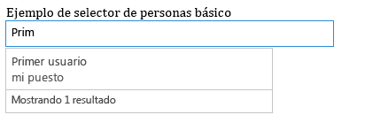

# Procedimiento para usar el widget experimental Selector de personas en aplicaciones para SharePoint
Aprenda a usar el widget Selector de personas en cualquier página web aunque no esté hospedada en SharePoint. Use el widget Selector de personas en sus complementos para ayudar a los usuarios a buscar y seleccionar personas y grupos.
> **PRECAUCIóN**
> Los Office Web Widgets: Experimental solo se proporcionan con fines de investigación y comentarios. No se deben usar en situaciones de producción. El comportamiento de Office Web Widgets puede cambiar significativamente en futuras versiones. Lea y revise los  [Términos de licencia de Office Web Widgets: Experimental](office-web-widgetsexperimental-license-terms.md). 
  
    
    

Puede usar el widget experimental Selector de personas en los complementos para ayudar a los usuarios a buscar y seleccionar personas y grupos en un inquilino. Los usuarios empiezan a escribir en el cuadro de texto y el widget recupera a las personas cuyo nombre o correo electrónico coincida con el texto.
**Figura 1. Widget Selector de personas resolviendo una consulta**

  
    
    

  
    
    

  
    
    

  
    
    

  
    
    
Su complemento puede obtener acceso a las personas seleccionadas leyendo la propiedad **selectedItems** del widget. La propiedad selectedItems es una matriz de objetos que representan personas o grupos. La tabla siguiente muestra las propiedades disponibles del objeto de usuario.

|**Propiedad**|**Descripción**|
|:-----|:-----|
|**department** <br/> |Representa el departamento del usuario o grupo.  <br/> |
|**displayName** <br/> |Representa el nombre para mostrar del usuario o grupo.  <br/> |
|**email** <br/> |Representa la dirección de correo del usuario o grupo.  <br/> |
|**isResolved** <br/> |Indica si el widget ha resuelto correctamente el texto del widget con un usuario o grupo del inquilino.  <br/> |
|**jobTitle** <br/> |Representa el puesto de trabajo del usuario.  <br/> |
|**loginName** <br/> |Representa el nombre de inicio de sesión del usuario o grupo.  <br/> |
|**mobile** <br/> |Representa el número de teléfono móvil del usuario o grupo.  <br/> |
|**principalId** <br/> |Representa el id. principal del usuario o grupo.  <br/> |
|**principalType** <br/> |Indica si el elemento es un usuario o un grupo. Si es un usuario, el valor es 1; si es un grupo, 4.  <br/> |
|**sipAddress** <br/> |Representa la dirección sip del usuario o grupo.  <br/> |
|**text** <br/> |Representa el título de texto del nombre de usuario o grupo.  <br/> |
   
El widget Selector de personas tiene una memoria caché de las entradas utilizadas recientemente (MRU). La memoria caché almacena las cinco últimas entradas que el widget resolvió.
## Requisitos previos para seguir los ejemplos de este artículo

Para seguir los ejemplos de este artículo, necesita lo siguiente:
  
    
    

- Visual Studio 2013.
    
  
- Administrador de paquetes NuGet. Para más información, vea  [Instalar NuGet](http://go.microsoft.com/fwlink/?LinkId=271465).
    
  
- Un entorno de desarrollo de SharePoint 2013 (hay que aislar la aplicación en los escenarios locales).
    
  
- Paquete Office Web Widgets: Experimental de NuGet. Para más información sobre cómo instalar un paquete de NuGet, vea  [Administrar paquetes de NuGet desde el cuadro de diálogo](http://docs.nuget.org/docs/start-here/managing-nuget-packages-using-the-dialog). También puede visitar la  [página de la galería de NuGet](http://www.nuget.org/packages/Microsoft.Office.WebWidgets.Experimental/).
    
  

## Usar el widget Selector de personas en un Complemento de SharePoint hospedado por el proveedor

En este ejemplo, hay una página sencilla hospedada fuera de SharePoint que declara un widget Selector de personas usando marcado. Para no complicar las cosas, en este ejemplo no se declara ninguna opción, pero se puede ver un ejemplo con las opciones en la sección  [Pasos siguiente](use-the-experimental-people-picker-widget-in-sharepoint-add-ins.md#NextSteps).
  
    
    
Para usar el widget Selector de personas, debe hacer lo siguiente:
  
    
    

- Crear un Complemento de SharePoint y proyectos web.
    
  
- Crear un módulo en la web de complemento. Este paso garantiza que se cree una web de complemento cuando los usuarios implementen el complemento.
    
    > **NOTA**
      > La biblioteca entre dominios requiere la existencia de un web de complemento. El widget Selector de personas se comunica con SharePoint usando la biblioteca entre dominios. 
- Crear una página de complemento que declare una instancia del widget Selector de personas usando marcado.
    
  

### Para crear un Complemento de SharePoint y proyectos web


1. Abra Visual Studio 2013 como administrador. (Para ello, seleccione el icono de Visual Studio 2013 en el menú **Inicio** y elija **Ejecutar como administrador**).
    
  
2. Cree un nuevo proyecto usando la plantilla de Complemento de SharePoint 2013. La plantilla de **Complemento de SharePoint 2013** está en **Plantillas**> **Visual C#**, **Office/SharePoint**> **Complementos**.
    
  
3. Indique la dirección URL del sitio web de SharePoint que quiere usar para la depuración.
    
  
4. Seleccione **Hospedada por el proveedor** como la opción de hospedaje del complemento.
    
    > **NOTA**
      > También puede usar el widget Selector de personas con otras opciones de hospedaje o incluso con complementos para Office o su propio sitio web. 
5. Seleccione **Aplicación de formularios Web Forms ASP.NET** como tipo de proyecto de aplicación web.
    
  
6. Seleccione **Servicio de control de acceso de Windows Azure** como opción de autenticación.
    
  

### Para crear un módulo en la web de complemento


1. Elija el proyecto de Complemento de SharePoint en el **Explorador de soluciones** y luego seleccione **Agregar**> **Nuevo elemento…**
    
  
2. Elija **Elementos de Visual C#**> **Office/SharePoint**> **Módulo**. Póngale un nombre al módulo.
    
    > **NOTA**
      > Si va a crear una Complementos hospedados en SharePoint, no es necesario crear un módulo adicional. 

### Para agregar una nueva página que use el widget Selector de personas


1. Elija la carpeta **Páginas** del proyecto web en **Explorador de soluciones**.
    
  
2. Copie el código siguiente y péguelo en un archivo **ASPX** del proyecto. El código realiza las tareas siguientes:
    
  - Agrega referencias a las bibliotecas y los recursos de Office necesarios.
    
  
  - Inicializa el tiempo de ejecución de los controles.
    
  
  - Ejecuta el método **renderAll** del tiempo de ejecución de los controles de Office.
    
  
  - Declara un marcador de posición para el widget Selector de personas.
    
  

  ```
  
<!DOCTYPE html>
<html>
<head>
    <!-- IE9 or superior -->
    <meta http-equiv="X-UA-Compatible" content="IE=9" >
    <title>People Picker HTML Markup</title>

    <!-- Widgets Specific CSS File -->
    <link 
        rel="stylesheet" 
        type="text/css" 
        href="../Scripts/Office.Controls.css" 
    />

    <!-- Ajax, jQuery, and utils --> 
    <script 
        src=" https://ajax.aspnetcdn.com/ajax/4.0/1/MicrosoftAjax.js.js">
    </script>
    <script 
        src=" https://ajax.aspnetcdn.com/ajax/jQuery/jquery-1.9.1.min.js">
    </script>
    <script type="text/javascript">
        // Function to retrieve a query string value.
        // For production purposes you may want to use
        //  a library to handle the query string.
        function getQueryStringParameter(paramToRetrieve) {
            var params =
                document.URL.split("?")[1].split("&amp;");
            var strParams = "";
            for (var i = 0; i < params.length; i = i + 1) {
                var singleParam = params[i].split("=");
                if (singleParam[0] == paramToRetrieve)
                    return singleParam[1];
            }
        }
    </script>

    <!-- Cross-Domain Library and Office controls runtime -->
    <script type="text/javascript">
        //Register namespace and variables used through the sample
        Type.registerNamespace("Office.Samples.PeoplePickerBasic");
        //Retrieve context tokens from the querystring
        Office.Samples.PeoplePickerBasic.appWebUrl =
            decodeURIComponent(getQueryStringParameter("SPAppWebUrl"));
        Office.Samples.PeoplePickerBasic.hostWebUrl =
            decodeURIComponent(getQueryStringParameter("SPHostUrl"));

        //Pattern to dynamically load JSOM and and the cross-domain library
        var scriptbase =
            Office.Samples.PeoplePickerBasic.hostWebUrl + "/_layouts/15/";

        //Get the cross-domain library
        $.getScript(scriptbase + "SP.RequestExecutor.js",
            //Get the Office controls runtime and 
            //  continue to the createControl function
            function () {
                $.getScript("../Scripts/Office.Controls.js", createControl)
            }
        );
    </script>

    <!--People Picker -->
    <script 
        src="../Scripts/Office.Controls.PeoplePicker.js" 
        type="text/javascript">
    </script>
</head>
<body>
Basic People Picker sample (HTML markup declaration):
<div 
        id="PeoplePickerDiv" 
        data-office-control="Office.Controls.PeoplePicker">
</div>

<script type="text/javascript">
    function createControl() {
        //Initialize Controls Runtime
        Office.Controls.Runtime.initialize({
            sharePointHostUrl: Office.Samples.PeoplePickerBasic.hostWebUrl,
            appWebUrl: Office.Samples.PeoplePickerBasic.appWebUrl
        });

        //Render the widget, this must be executed after the
        //placeholder DOM is loaded
        Office.Controls.Runtime.renderAll();
    }
</script>
</body>
</html>

  ```


> **NOTA**
> El ejemplo de código anterior especifica explícitamente las direcciones URL de la web de hospedaje y la web de complemento para inicializar el tiempo de ejecución de los controles de Office. Sin embargo, si las direcciones URL de la web de complemento y la web de hospedaje se especifican en los parámetros de cadena de consulta **SPAppWebUrl** y **SPHostUrl** respectivamente, se puede pasar un objeto vacío para que el código intente obtener los parámetros de forma automática. Los parámetros **SPAppWebUrl** y **SPHostUrl** se incluyen en la cadena de consulta cuando se usa el token **{StandardTokens}**.
  
    
    

En el siguiente ejemplo se muestra cómo pasar un objeto vacío al método de inicialización:
  
    
    


```

// Initialize with an empty object and the code
// will attempt to get the tokens from the
// query string directly.
Office.Controls.Runtime.initialize({});
```


### Para crear y ejecutar la solución


1. Presione la tecla F5.
    
    > **NOTA**
      > Al presionar F5, Visual Studio crea la solución, implementa el complemento y abre la página de permisos del complemento. 
2. Elija el botón **Confiar**.
    
  
3. Elija el icono del complemento en la página **Contenidos del sitio**.
    
  
También puede bajarse este ejemplo desde la galería de códigos. Vea el ejemplo de código  [Usar el widget experimental Selector de personas en un complemento](http://code.msdn.microsoft.com/SharePoint-2013-Use-the-57859f85). 
  
    
    

## 
<a name="NextSteps"> </a>

En este artículo le enseñamos a usar el widget Selector de personas en su complemento con HTML. También puede explorar los siguientes escenarios y detalles sobre el widget.
  
    
    

### Usar JavaScript para declarar el widget Selector de personas

Quizás prefiera usar JavaScript en lugar de HTML para declarar el widget. Si es el caso, puede utilizar el siguiente marcado como marcador de posición para el widget.
  
    
    

```HTML

<div id="PeoplePickerDiv"></div>
```

Use el siguiente código de JavaScript para crear instancias del selector de personas.
  
    
    


```
new Office.Controls.PeoplePicker(
    document.getElementById("PeoplePickerDiv"), {});
```

Si quiere ver un ejemplo de código de cómo hacer las tareas, vaya a la página **JSSimple.html** en el ejemplo de código [Usar el widget experimental Selector de personas en un complemento](http://code.msdn.microsoft.com/SharePoint-2013-Use-the-57859f85).
  
    
    

### Especificar las opciones del widget

Puede especificar opciones para el widget usando el atributo **datos-office-opciones** en la declaración del widget. El código HTML siguiente muestra cómo especificar las opciones del widget Selector de personas.
  
    
    

```HTML

<div id="PeoplePickerDiv"
        data-office-control="Office.Controls.PeoplePicker"
        data-office-options='{
        "allowMultipleSelections" : true,
        "onChange" : handleChange,
        "placeholder" : "Check the count message, it changes when you add names..."
    }'>
</div>
```

El código siguiente muestra cómo especificar opciones al declarar el widget Selector de personas usando JavaScript.
  
    
    


```

new Office.Controls.PeoplePicker(
    document.getElementById("PeoplePickerDiv"), {
        allowMultipleSelections: true,
        placeholder: "Check the count message, it changes when you add names...",
        onChange: function (ctrl) {
            document.getElementById("count").textContent = 
ctrl.selectedItems.length.toString();
        }
    });
```

También puede especificar controladores de eventos para los eventos **onChange**, **onAdded** y **onRemoved**. En el código anterior, vemos que el controlador de eventos del evento onChange recibe un único parámetro **ctrl**, que es una referencia al widget.
  
    
    
Para consultar un ejemplo de cómo especificar opciones, vea las páginas **MarkupOptions.html** y **JSOptions.html** en el ejemplo de código [Usar el widget experimental Selector de personas en un complemento](http://code.msdn.microsoft.com/SharePoint-2013-Use-the-57859f85).
  
    
    

### Recuperar a las personas o los grupos seleccionados en el widget

Para recuperar a las personas del widget debe hacer las siguientes tareas:
  
    
    

- Obtener una referencia al widget.
    
  
- Obtener acceso a la propiedad **selectedItems** del widget.
    
  
Puede obtener una referencia al widget usando la sintaxis siguiente.
  
    
    


```

var pplPicker = document.getElementById("PeoplePickerDiv")._officeControl;
```

También puede guardar una referencia al crear instancias del widget.
  
    
    


```
var pplPicker = new Office.Controls.PeoplePicker(
                        document.getElementById("PeoplePickerDiv"), {});
```

La propiedad **selectedItems** es una matriz de objetos que representan personas o grupos. Las personas o grupos de la matriz selectedItems pueden estar resueltos o no, y esto se puede comprobar en la propiedad **isResolved**. En el ejemplo siguiente se muestra cómo obtener acceso al elemento *i*  de la matriz y usar el nombre de la persona o grupo.
  
    
    


```

var principal = pplPicker.selectedItems[i];
$("#msg").text(principal.text + " is selected in the control.");
```

Si quiere un ejemplo de cómo recuperar del widget las personas o los grupos seleccionados, vea la página **demo.html** del ejemplo de código [Demostración de Office Web Widgets: Experimental](http://code.msdn.microsoft.com/SharePoint-2013-Office-Web-6d44aa9e).
  
    
    

### Personalizar el estilo del widget

Como desarrollador, puede querer personalizar la apariencia del widget. La imagen siguiente muestra la jerarquía de HTML en el widget después de representarse.
  
    
    

**Figura 2. Jerarquía HTML en el widget Selector de personas**

  
    
    

  
    
    

  
    
    
El widget define muchas clases con el prefijo **office-peoplepicker**, que puede encontrar y personalizar en la hoja de estilos **Office.Controls.css**.
  
    
    

## Conclusión
<a name="NextSteps"> </a>

Puede usar el widget experimental Selector de personas para seleccionar personas y grupos en el inquilino, y su complemento puede, luego, usar las entidades de seguridad seleccionadas por los usuarios. Envíe sus ideas y comentarios al  [sitio Office Developer Platform UserVoice](http://officespdev.uservoice.com/).
  
    
    

## Recursos adicionales
<a name="bk_addresources"> </a>


-  [Introducción a Office Web Widgets: Experimental](office-web-widgetsexperimental-overview.md)
    
  
-  [Términos de licencia de Office Web Widgets: Experimental](office-web-widgetsexperimental-license-terms.md)
    
  
-  [Página de la galería NuGet de Office Web Widgets: Experimental](http://www.nuget.org/packages/Microsoft.Office.WebWidgets.Experimental/)
    
  
-  [Ejemplo de código: Usar el widget experimental Selector de personas en un complemento](http://code.msdn.microsoft.com/SharePoint-2013-Use-the-57859f85)
    
  
-  [Usar el widget experimental Vista de lista de escritorio en complementos para SharePoint](use-the-experimental-desktop-list-view-widget-in-sharepoint-add-ins.md) .
    
  

