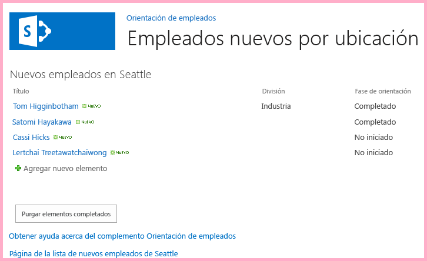
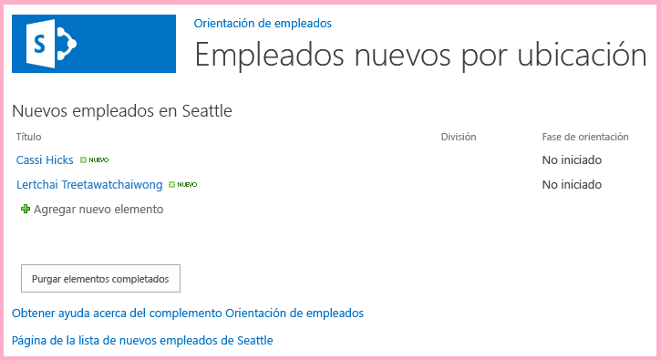

# Usar las API de JavaScript de SharePoint para trabajar con datos de SharePoint
Use el modelo de objetos de JavaScript de SharePoint para trabajar con datos de SharePoint desde JavaScript en páginas de la web de complemento.
Este es el décimo de una serie de artículos sobre los conceptos básicos de desarrollo de Complementos de SharePoint hospedados en SharePoint. Primero debe familiarizarse con los  [Complementos de SharePoint](sharepoint-add-ins.md) y con los anteriores artículos de esta serie:


-  [Empezar a crear complementos hospedados en SharePoint para SharePoint](get-started-creating-sharepoint-hosted-sharepoint-add-ins.md)


-  [Implementar e instalar un complemento hospedado en SharePoint para SharePoint](deploy-and-install-a-sharepoint-hosted-sharepoint-add-in.md)


-  [Agregar columnas personalizadas a un complemento de SharePoint hospedado en SharePoint](add-custom-columns-to-a-sharepoint-hostedsharepoint-add-in.md)


-  [Agregar un tipo de contenido personalizado a un complemento de SharePoint hospedado en SharePoint](add-a-custom-content-type-to-a-sharepoint-hostedsharepoint-add-in.md)


-  [Agregar un elemento web a una página de un complemento para SharePoint hospedado en SharePoint](add-a-web-part-to-a-page-in-a-sharepoint-hosted-sharepoint-add-in.md)


-  [Agregar un flujo de trabajo a un complemento hospedado en SharePoint para SharePoint](add-a-workflow-to-a-sharepoint-hosted-sharepoint-add-in.md)


-  [Agregar una página y un estilo personalizados a un complemento hospedado en SharePoint para SharePoint](add-a-custom-page-and-style-to-a-sharepoint-hosted-sharepoint-add-in.md)


-  [Agregar representación del lado cliente personalizada a un complemento de SharePoint hospedado en SharePoint](add-custom-client-side-rendering-to-a-sharepoint-hosted-sharepoint-add-in.md)


-  [Crear un botón personalizado de la cinta de opciones en la web de host de un complemento de SharePoint](create-a-custom-ribbon-button-in-the-host-web-of-a-sharepoint-add-in.md)


> **NOTA**
> Si ha estado trabajando en esta serie sobre complementos hospedados en SharePoint, ya tiene una solución de Visual Studio que puede usar para continuar con este tema. También puede descargar el repositorio en  [SharePoint_SP-hosted_Add-Ins_Tutorials](https://github.com/OfficeDev/SharePoint_SP-hosted_Add-Ins_Tutorials) y abrir el archivo BeforeJSOM.sln.


Aunque los Complementos de SharePoint hospedados en SharePoint no pueden tener código de servidor, se puede tener interacción de tiempo de ejecución y la lógica empresarial con componentes de SharePoint en un Complemento de SharePoint hospedado por SharePoint mediante JavaScript y la biblioteca del modelo de objetos de cliente de SharePoint JavaScript. (Lo llamaremos JSOM. Fíjese en la "M" del final. No lo confunda con JSO **N** [notación de objetos JavaScript]). En este artículo se usa el modelo de objetos de JavaScript para buscar y quitar los elementos antiguos de la lista **Nuevos empleados de Seattle**.
## Crear el JavaScript y un botón que lo invoca


1. Compruebe que se ha completado el paso siguiente del primer tutorial de esta serie: 

    Abra el archivo **/Pages/Default.aspx** de la raíz del proyecto. Entre otras cosas, este archivo generado carga uno o ambos scripts que se hospedan en SharePoint: sp.runtime.js y sp.js. La marca para cargar estos archivos está en el control **Content** situado cerca de la parte superior del archivo que tiene el ID **PlaceHolderAdditionalPageHead**. La marca varía según la versión de **Microsoft Office Developer Tools para Visual Studio** que está utilizando. Esta serie de tutoriales requiere que ambos archivos se carguen mediante etiquetas HTML de **<script>**, no con etiquetas de **<SharePoint:ScriptLink>**. Asegúrese de que las líneas siguientes están en el control **PlaceHolderAdditionalPageHead**,  *justo encima*  de la línea `<meta name="WebPartPageExpansion" content="full" />`:


 ```

<script type="text/javascript" src="/_layouts/15/sp.runtime.js"></script>
<script type="text/javascript" src="/_layouts/15/sp.js"></script> 

 ```


    A continuación, busque en el archivo cualquier otra marca que también permita cargar uno de estos archivos y quite la marca redundante. Guarde y cierre el archivo.


2. En el nodo **Scripts** del **Explorador de soluciones**, puede que ya haya un archivo Add-in.js. Si no lo hay, pero hay un App.js, haga clic con el botón derecho en App.js y cambie el nombre a Add-in.js. Si no hay un archivo Add-in.js ni App.js, cree uno con estos pasos:

1. Haga clic con el botón derecho en el nodo **Scripts** y elija **Agregar** > **Nuevo elemento** > **Web**.


2. Elija **Archivo JavaScript** y asígnele el nombreAdd-in.js.


3. Abra Add-in.js y elimine el contenido que tenga.


4. Agregue las siguientes líneas al archivo. Tenga en cuenta lo siguiente sobre este código:

  - La línea  `'use strict';` garantiza que el tiempo de ejecución de JavaScript en el explorador generará una excepción si sigue accidentalmente determinadas prácticas incorrectas en el JavaScript.


  - La variable  `clientContext` contiene un objeto **SP.ClientContext** que hace referencia al sitio web de SharePoint. Todo código JSOM empieza al crear o al obtener una referencia a un objeto de este tipo.


  - La variable  `employeeList` contiene una referencia a la instancia de lista **Nuevos empleados de Seattle**.


  - La variable  `completedItems` contiene los elementos de la lista que el script eliminará: los elementos cuyo campo **OrientationStage** esté establecido en **Completado**.


 ```

'use strict';

var clientContext = SP.ClientContext.get_current(); 
var employeeList = clientContext.get_web().get_lists().getByTitle('New Employees In Seattle'); 
var completedItems; 
 ```

5. Para reducir al mínimo los mensajes entre el explorador del cliente y el servidor de SharePoint, el JSOM usa un sistema de procesamiento por lotes. Solo una función, **SP.ClientContext.executeQueryAsync**, en realidad envía mensajes al servidor (y recibe respuestas). Las llamadas a las API del JSOM que llegan entre llamadas de **executeQueryAsync** se empaquetan y se envían al servidor en un lote la próxima vez que se llama a **executeQueryAsync**. Sin embargo, generalmente no es posible llamar a un método de un objeto JSOM a menos que el objeto se haya llevado al cliente en una llamada anterior de **executeQueryAsync**. El script va a llamar al método **SP.ListItem.deleteObject** de cada elemento completado en la lista, por lo que tiene que hacer dos llamadas de **executeQueryAsync**: una para obtener una colección de los elementos de lista completados y luego una segunda para procesar por lotes las llamadas de **deleteObject** y enviarlas al servidor para su ejecución.

    Por lo tanto, empiece por crear un método para obtener los elementos de lista desde el servidor. Agregue el siguiente código al archivo.


 ```

function purgeCompletedItems() {

   var camlQuery = new SP.CamlQuery(); 
   camlQuery.set_viewXml( 
         '<View><Query><Where><Eq>' + 
           '<FieldRef Name=\\'OrientationStage\\'/><Value Type=\\'Choice\\'>Completed</Value>' + 
         '</Eq></Where></Query></View>'); 
     completedItems = employeeList.getItems(camlQuery); 
}
 ```

6. Cuando se envían al servidor y se ejecutan allí estas líneas, crean una colección de elementos de lista, pero el script debe llevar esa colección al cliente. Esto se hace con una llamada a la función **SP.ClientContext.load**. Por lo tanto, agregue la siguiente línea al final del método.

 ```

clientContext.load(completedItems);
 ```

7. Agregue una llamada de **executeQueryAsync**. Este método tiene dos parámetros, los cuales son funciones de devolución de llamada. El primero se ejecuta si el servidor ejecuta correctamente todos los comandos del lote. El segundo se ejecuta si el servidor falla por cualquier motivo. Crearemos estas dos funciones en pasos posteriores. Agregue la siguiente línea al final del método.

 ```
  clientContext.executeQueryAsync(deleteCompletedItems, onGetCompletedItemsFail);
 ```

8. Por último, agregue la siguiente línea al final del método. Al devolver **false** al botón ASP.NET que llamará a la función, se cancela el comportamiento predeterminado de los botones ASP.NET, que es volver a cargar la página. Una recarga de la página provocaría una recarga del archivo Add-in.js. Esto, a su vez, reinicializaría el objeto `clientContext`. Si esta recarga se completa entre el momento en que **executeQueryAsync** envía su solicitud y el tiempo en que el servidor de SharePoint envía la respuesta, el objeto original `clientContext` ya no se encuentra para procesar la respuesta. La función se detendría sin que se ejecuten las devoluciones de llamada de confirmación o error. (El comportamiento exacto podría variar según el explorador).

 ```
  return false;
 ```

9. Agregue la siguiente función,  `deleteCompletedItems`, al archivo. Esta es la función que se ejecuta si la función  `purgeCompletedItems` es correcta. Tenga en cuenta lo siguiente sobre este código:

  - El método **SP.ListItem.get_id** devuelve el identificador del elemento de lista. Cada elemento de la matriz es un objeto **SP.ListItem**.


  - El método **SP.List.getItemById** devuelve el objeto **SP.ListItem** con el identificador especificado.


  - El método **SP.ListItem.deleteObject** marca el elemento de lista que se eliminará en el servidor cuando se realice la llamada de **executeQueryAsync**.


  - Los elementos de lista tienen que copiarse desde la colección que se envía desde el servidor a una matriz para poder eliminarlos. Si el script llamara al método **deleteObject** para cada elemento directamente en el bucle **while**, el JavaScript generaría un error notificando que se está modificando la longitud de la colección mientras la enumeración está en curso. El mensaje de error no es literalmente verdadero, porque el elemento no se elimina realmente de ningún sitio hasta que las llamadas de **deleteObject** se empaqueten y se envíen al servidor, pero el JSOM está diseñado para imitar las excepciones que se producirían en el servidor (donde el código no debe cambiar el tamaño de la colección mientras esta se está enumerando). Sin embargo, las matrices tienen un tamaño fijo, por lo que llamar a **deleteObject** en un elemento de una matriz elimina el elemento de la lista, pero no cambia el tamaño de la matriz.


 ```
  function deleteCompletedItems() {

    var itemArray = new Array();
    var listItemEnumerator = completedItems.getEnumerator();

    while (listItemEnumerator.moveNext()) {
        var item = listItemEnumerator.get_current();
        itemArray.push(item);
    }

    var i;
    for (i = 0; i < itemArray.length; i++) {
        employeeList.getItemById(itemArray[i].get_id()).deleteObject();
    }

    clientContext.executeQueryAsync(onDeleteCompletedItemsSuccess, onDeleteCompletedItemsFail);
}
 ```

10. Agregue la siguiente función,  `onDeleteCompletedItemsSuccess`, al archivo. Esta es la función que se ejecuta si se eliminan correctamente los elementos completados (o no hay elementos completados en la lista). La segunda línea,  `location.reload(true);`, hace que la página vuelva a cargarse desde el servidor. Es muy útil porque el elemento web de la vista de lista en la página aún muestra los elementos completados hasta que se actualice la página. (Se vuelve a cargar también el archivo Add-in.js, pero no causa problemas porque no lo hará de manera que interrumpa una función de JavaScript en curso).

 ```

function onDeleteCompletedItemsSuccess() {
    alert('Completed orientations have been deleted.');
    location.reload(true);
}
 ```

11. Agregue al archivo las dos funciones siguientes de devolución de llamada en caso de error.

 ```

// Failure callbacks

function onGetCompletedItemsFail(sender, args) {
    alert('Unable to get completed items. Error:' + args.get_message() + '\\n' + args.get_stackTrace());
}

function onDeleteCompletedItemsFail(sender, args) {
    alert('Unable to delete completed items. Error:' + args.get_message() + '\\n' + args.get_stackTrace());
}
 ```

12. Abra el archivo default.aspx y busque el elemento **asp:Content** con el identificador **PlaceHolderMain**.


13. Agregue el siguiente marcado entre el elemento **WebPartPages:WebPartZone** y el primero de los dos elementos **asp:Hyperlink**. Tenga en cuenta que el valor del controlador **OnClientClick** es `return purgeCompletedItems()` en lugar de simplemente `purgeCompletedItems()`. El  `false` que la función devuelve indica a ASP.NET que no vuelva a cargar la página.

 ```HTML

<p><asp:Button runat="server" OnClientClick="return purgeCompletedItems()"
  ID="purgecompleteditemsbutton" Text="Purge Completed Items" /></p>
 ```

14. Recompile el proyecto en Visual Studio.


15. Para minimizar la necesidad de establecer manualmente la **Fase de orientación** de elementos de lista enCompletada mientras se prueba el complemento, abra el archivo elements.xml de la instancia de lista **NewEmployeesInSeattle** (no elements.xml de la plantilla de lista **NewEmployeeOrientation**) y agregue el marcado  `<Field Name="OrientationStage">Completed</Field>` como último elemento secundario a uno o más de los elementos **Row**.

    El siguiente es un ejemplo del aspecto del elemento **Rows**.


 ```

<Rows>
  <Row>
    <Field Name="Title">Tom Higginbotham</Field>
    <Field Name="Division">Manufacturing</Field>
    <Field Name="OrientationStage">Completed</Field>
  </Row>
  <Row>
    <Field Name="Title">Satomi Hayakawa</Field>
    <Field Name="OrientationStage">Completed</Field>
  </Row>
  <Row>
    <Field Name="Title">Cassi Hicks</Field>
  </Row>
  <Row>
    <Field Name="Title">Lertchai Treetawatchaiwong</Field>
  </Row>
</Rows>
 ```


## Ejecutar y probar el complemento


1. Habilite los elementos emergentes en el explorador que Visual Studio usa durante la depuración.


2. Use la tecla F5 para implementar y ejecutar el complemento. Visual Studio realizará una instalación temporal del complemento en el sitio de SharePoint de prueba y ejecutará el complemento inmediatamente.


3. Se abre la página principal del complemento y hay uno o más elementos en la lista con **Fase de orientación** en **Completada**.

   **Lista antes de la purga de los elementos completados**





4. Cuando se cargue por completo la página de inicio del complemento, elija el botón **Purgar elementos completados**. Si la operación se realiza correctamente (no obtiene ningún mensaje de error), todos los elementos **Completados** se eliminan y verá el cuadro de mensaje emergente **Las orientaciones completadas se eliminaron**.


5. Cierre la ventana emergente. La página se vuelve a cargar y los elementos **Completados** ya no están en el elemento web de vista de lista.

   **Lista después de la purga de los elementos completados**





6. Para terminar la sesión de depuración, cierre la ventana del explorador o detenga la depuración en Visual Studio. Cada vez que presione F5, Visual Studio retirará la versión anterior del complemento e instalará la más reciente.


7. Trabajará con este complemento y con la solución de Visual Studio en otros artículos, y se considera recomendable retirar el complemento una última vez cuando acabe de trabajar en él durante un tiempo. En el proyecto, haga clic con el botón derecho en el **Explorador de soluciones** y elija **Retirar**.


## 
<a name="Nextsteps"> </a>

En el siguiente artículo de esta serie, agregaremos JavaScript a una página en la web de complemento que funciona con los datos de SharePoint en la web de host:  [Trabajar con datos de web de host de JavaScript en la web de complemento](work-with-host-web-data-from-javascript-in-the-add-in-web.md).


