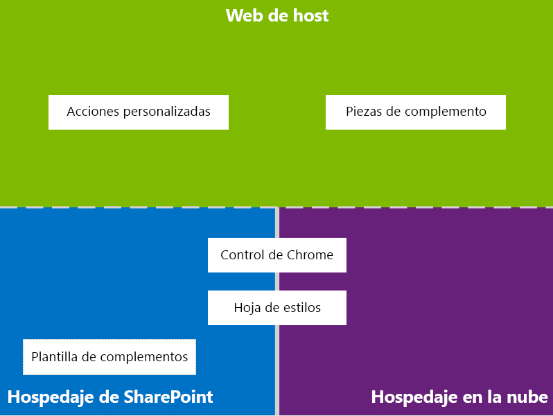
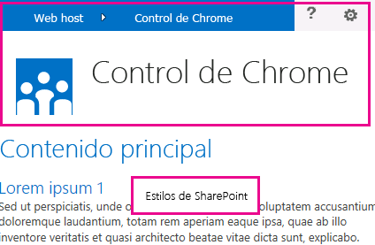
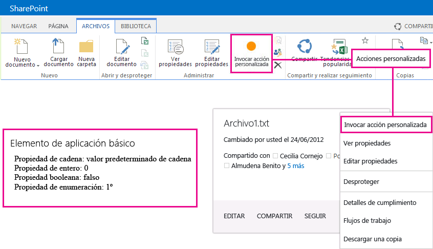

# Diseño de la experiencia de usuario para aplicaciones en SharePoint 2013
Aprenda sobre las opciones de experiencia de usuario (UX) disponibles cuando desarrolla complementos en SharePoint 2013.
Como desarrollador, siempre debe dar prioridad a la experiencia de usuario (UX) cuando desarrolle complementos. El modelo para aplicaciones para SharePoint ofrece muchos componentes y mecanismos para la UX que le ayudan a crear una gran experiencia para el usuario. La experiencia del usuario en el modelo de complementos también es lo suficientemente flexible para permitir el uso de técnicas y plataformas que mejor se adapten a las necesidades de los usuarios finales.

## Información general de alto nivel sobre la UX de complementos en SharePoint 2013

Como desarrollador de complementos, debe conocer la arquitectura del complemento. Una vez que determine cómo se distribuirá el complemento en plataformas de SharePoint remotas, podrá decidir entre las alternativas disponibles para crear la UX del complemento. Es posible que se pregunte lo siguiente:

- ¿Qué puedo usar si estoy creando un complemento hospedado en la nube?

- ¿Qué puedo usar si estoy creando un complemento hospedado en SharePoint? Para más información, vea  [Elegir patrones para desarrollar y hospedar un complemento para SharePoint](choose-patterns-for-developing-and-hosting-your-sharepoint-add-in.md).

- ¿Cómo puedo conectar mi UX a la web hospedaje? Para obtener más información, vea  [Hospedar webs, webs de complementos y componentes de SharePoint en SharePoint 2013](host-webs-add-in-webs-and-sharepoint-components-in-sharepoint-2013.md).

El siguiente diagrama muestra los escenarios y opciones principales que debe considerar cuando diseña la UX del complemento.

**Figura 1. Principales escenarios y opciones de la UX de complementos**

Cuando elija su diseño, considere principalmente qué elementos del complemento se hospedan o no en SharePoint. También debe considerar cómo el complemento interactuará con la web de hospedaje.

## Escenarios de la UX de complementos en complementos hospedados en la nube

Supongamos que decide que parte de la experiencia de usuario no se hospede en SharePoint. En estos escenarios, se espera que los usuarios finales vayan y vengan entre el sitio web de SharePoint y el complemento hospedado en la web. Puede usar las técnicas y herramientas en la plataforma, pero SharePoint también ofrece recursos para ayudarle a diseñar una experiencia sin obstáculos para los usuarios.

Los siguientes recursos de la UX están disponibles para los complementos hospedados en la nube en SharePoint 2013:

- **Control cromo:** Elcontrol cromo le permite usar el encabezado de navegación de un sitio determinado de SharePoint en el complemento sin necesidad de registrar una biblioteca de servidores o usar una tecnología o herramienta específica. Para usar esta función, debe registrar una biblioteca de SharePoint JavaScript a través de etiquetas estándar <script>. Puede proporcionar un marcador de posición con un elemento **div** HTML y además personalizar el control con las opciones disponibles. El control hereda su apariencia del sitio web de SharePoint especificado. Para obtener más información, vea [Usar el control cromo de cliente en complementos de SharePoint](use-the-client-chrome-control-in-sharepoint-add-ins.md).

   **Vea el vídeo: Control de cromo de SharePoint 2013**

- **Hoja de estilos:** Puede hacer una referencia a la hoja de estilos del sitio web de SharePoint en la Complemento de SharePoint y usarla para determinar el estilo de las páginas web con las clases disponibles. Además, si los usuarios finales cambian el tema del sitio web de SharePoint, el complemento puede adoptar el nuevo conjunto de estilos sin modificar la referencia en el complemento. Para obtener más información, vea [Usar una hoja de estilos del sitio web de SharePoint en complementos de SharePoint](use-a-sharepoint-website-s-style-sheet-in-sharepoint-add-ins.md).

La Figura 2 muestra los recursos en el modelo para aplicaciones para SharePoint para complementos hospedados en la nube.

**Figura 2. Recursos de la UX de complementos para complementos hospedados en la nube**

## Escenarios de la UX de complementos en complementos hospedados en SharePoint

Si el complemento está hospedado en SharePoint, es menos probable que cambie mucho la experiencia de usuario cuando los usuarios se muevan entre la web de hospedaje y la web del complemento. Cuando se implementa el complemento, la web del complemento adopta la hoja de estilos y el tema de la web de hospedaje. Aún puede usar el control del contenedor visual y la hoja de estilos en un complemento hospedado en SharePoint, pero la diferencia más significativa con los escenarios hospedados en la nube es la disponibilidad de la plantilla de complementos.

El siguiente recurso de UX está disponible para los complementos hospedados en SharePoint:

- **Plantilla de complementos:** La plantilla de complementos incluye la página maestra **app.master**. Es la opción predeterminada cuando crea una web de complementos.

Los complementos hospedados en SharePoint también aprovechan los recursos y las tecnologías existentes en SharePoint, como la cinta, la infraestructura de elementos web y la representación del lado cliente.

## Escenarios para conectar la UX del complemento a la web de hospedaje

Algunos de los casos de uso para el complemento se pueden activar desde la web de hospedaje. SharePoint ofrece formas para abrir el complemento desde una biblioteca o lista de documentos además de formas de mostrar algunas de las experiencias de usuario de los complementos dentro de las páginas hospedadas en SharePoint.

Los siguientes recursos de la UX están disponibles para conectar la UX del complemento a la web de hospedaje:

- **Acciones personalizadas**: puede usar acciones personalizadas para conectar la UX de la web host con el complemento. Hay dos tipos de acciones personalizadas: decinta o deECB. Una acción personalizada puede enviar parámetros como la lista o elemento sobre el que fue invocado a una página remota. Para obtener más información, vea  [Crear acciones personalizadas para implementarlas con complementos de SharePoint](create-custom-actions-to-deploy-with-sharepoint-add-ins.md).

- **Elementos de complementos:** Puede incluir parte de la experiencia de usuario del complemento en la web de hospedaje con elementos del complemento. El elemento del complemento está disponible en la galería Elementos web en la web de hospedaje cuando implementa el complemento. Los usuarios entonces pueden agregar el elemento del complemento a una página con el control **Agregador de elementos web**. Para obtener más información, vea [Crear elementos del complemento para instalar con el complemento para SharePoint](create-add-in-parts-to-install-with-your-sharepoint-add-in.md).

La Figura 3 muestra los recursos en el modelo para aplicaciones para SharePoint para conectar la UX de complementos a la web de hospedaje.

**Figura 3. Recursos de la UX de complementos para la web de hospedaje**

## Recursos adicionales

Para aprender a usar las opciones de la UX de complemento en Complementos de SharePoint, vea los siguientes recursos:

-  [Diseñar aplicaciones para SharePoint](design-sharepoint-add-ins.md)

-  [Complementos de SharePoint](sharepoint-add-ins.md)

-  [Tres formas de concebir las opciones de diseño de complementos para SharePoint](three-ways-to-think-about-design-options-for-sharepoint-add-ins.md)

-  [Aspectos importantes del panorama de desarrollo y arquitectura de los complementos para SharePoint](important-aspects-of-the-sharepoint-add-in-architecture-and-development-landscap.md)

-  [Hospedar webs, webs de complementos y componentes de SharePoint en SharePoint 2013](host-webs-add-in-webs-and-sharepoint-components-in-sharepoint-2013.md)

-  [Directrices de diseño de los complementos para la experiencia de usuario de SharePoint](sharepoint-add-ins-ux-design-guidelines.md)

-  [Crear componentes de experiencia de usuario en SharePoint 2013](create-ux-components-in-sharepoint-2013.md)

-  [Usar una hoja de estilos del sitio web de SharePoint en complementos de SharePoint](use-a-sharepoint-website-s-style-sheet-in-sharepoint-add-ins.md)

-  [Usar el control cromo de cliente en complementos de SharePoint](use-the-client-chrome-control-in-sharepoint-add-ins.md)

-  [Crear elementos del complemento para instalar con el complemento para SharePoint](create-add-in-parts-to-install-with-your-sharepoint-add-in.md)

-  [Crear acciones personalizadas para implementarlas con complementos de SharePoint](create-custom-actions-to-deploy-with-sharepoint-add-ins.md)

