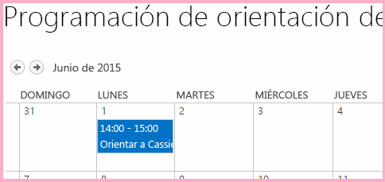
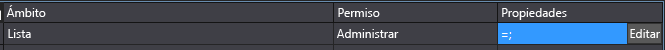
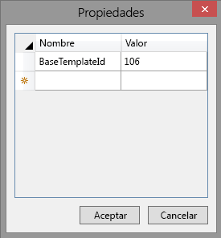
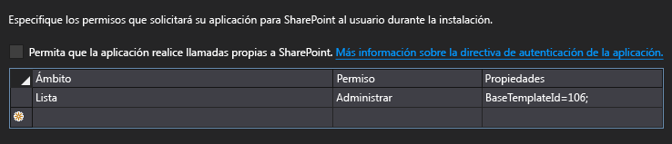
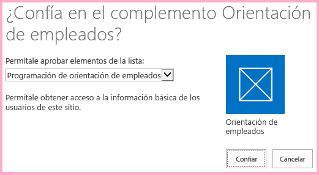
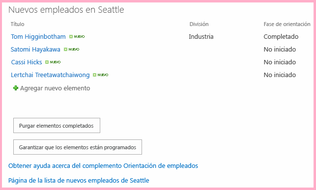
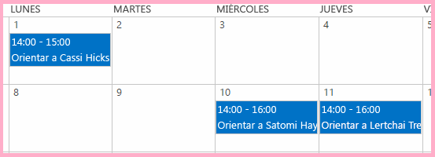

# Trabajar con datos de web de host de JavaScript en la web de complemento
Use el modelo de objetos de JavaScript (JSOM) de SharePoint para trabajar con datos de SharePoint en la web de host de JavaScript en páginas de la web de complemento.
Este es el decimoprimero de una serie de artículos sobre los conceptos básicos de desarrollo de Complementos de SharePoint hospedados en SharePoint. Primero debe familiarizarse con los  [Complementos de SharePoint](sharepoint-add-ins.md) y con los anteriores artículos de esta serie:


-  [Empezar a crear complementos hospedados en SharePoint para SharePoint](get-started-creating-sharepoint-hosted-sharepoint-add-ins.md)


-  [Implementar e instalar un complemento hospedado en SharePoint para SharePoint](deploy-and-install-a-sharepoint-hosted-sharepoint-add-in.md)


-  [Agregar columnas personalizadas a un complemento de SharePoint hospedado en SharePoint](add-custom-columns-to-a-sharepoint-hostedsharepoint-add-in.md)


-  [Agregar un tipo de contenido personalizado a un complemento de SharePoint hospedado en SharePoint](add-a-custom-content-type-to-a-sharepoint-hostedsharepoint-add-in.md)


-  [Agregar un elemento web a una página de un complemento para SharePoint hospedado en SharePoint](add-a-web-part-to-a-page-in-a-sharepoint-hosted-sharepoint-add-in.md)


-  [Agregar un flujo de trabajo a un complemento hospedado en SharePoint para SharePoint](add-a-workflow-to-a-sharepoint-hosted-sharepoint-add-in.md)


-  [Agregar una página y un estilo personalizados a un complemento hospedado en SharePoint para SharePoint](add-a-custom-page-and-style-to-a-sharepoint-hosted-sharepoint-add-in.md)


-  [Agregar representación del lado cliente personalizada a un complemento de SharePoint hospedado en SharePoint](add-custom-client-side-rendering-to-a-sharepoint-hosted-sharepoint-add-in.md)


-  [Crear un botón personalizado de la cinta de opciones en la web de host de un complemento de SharePoint](create-a-custom-ribbon-button-in-the-host-web-of-a-sharepoint-add-in.md)


-  [Usar las API de JavaScript de SharePoint para trabajar con datos de SharePoint](use-the-sharepoint-javascript-apis-to-work-with-sharepoint-data.md)


> **NOTA**
> Si ha estado trabajando en esta serie sobre complementos hospedados en SharePoint, ya tiene una solución de Visual Studio que puede usar para continuar con este tema. También puede descargar el repositorio en  [SharePoint_SP-hosted_Add-Ins_Tutorials](https://github.com/OfficeDev/SharePoint_SP-hosted_Add-Ins_Tutorials) y abrir el archivo BeforeHostWebData.sln.


De forma predeterminada, SharePoint está diseñado para impedir que JavaScript en un complemento obtenga acceso a los datos en otros sitios web de SharePoint de la granja de servidores. Esto impide que el script de un complemento no confiable obtenga acceso a datos confidenciales. Pero a menudo un complemento necesita tener acceso a la web de host o a otros sitios web dentro de la misma colección de sitios que la web de host. Hay dos partes para habilitar este escenario en el complemento:
- Debemos solicitar permiso a la web de host en el archivo de manifiesto del complemento. Al usuario que instala el complemento se le pedirá que conceda este permiso. El complemento no se puede instalar si el usuario no lo concede.


- En lugar de usar un objeto **SP.ClientContext** para realizar llamadas JSOM a la web de host, use un objeto **SP.AppContextSite**. Este objeto permite al complemento obtener objetos de un contexto para sitios web distintos a la web de complemento, pero solo para sitios web dentro de la misma colección de sitios. (También existe una manera de obtener acceso a cualquier sitio web en la suscripción a SharePoint Online [o aplicación web de SharePoint local], pero eso es un tema avanzado). 


 En este artículo se usa el JSOM para buscar las orientaciones que aún no se iniciaron y asegurarse de que se programan en un calendario en la web de host.
## Preparar el calendario de la web de host

Abra la web de host (su sitio web de prueba para desarrolladores) y compruebe que existe un calendario con el nombre "Programación de orientación del empleado" y tiene un único evento: "Orientar a Cassie Hicks". Si no existe, siga estos pasos:


1. En la página principal del sitio, elija **Contenido del sitio** > **agregar un complemento** > **Calendario**.


2. En el cuadro de diálogo **Agregar calendario**, escriba Programación de orientación del empleado en el **Nombre** y luego elija **Crear**.


3. Cuando se abra el calendario, coloque el cursor en cualquier fecha hasta que aparezca el vínculo **Agregar** en la fecha y, a continuación, haga clic en **Agregar**. 


4. En el cuadro de diálogo **Programación de orientación del empleado: nuevo elemento**, escriba Orientar a Cassi Hicks en el **Título**. Deje el resto de los campos con sus valores predeterminados y haga clic en **Guardar**.

    El calendario debe ser similar al siguiente:


   **Calendario personalizado**





## Crear el JavaScript y un botón que lo invoca


1. Abra el archivo Add-in.js en el nodo **Scripts** del **Explorador de soluciones**. 


2. Agregue las siguientes declaraciones debajo de la declaración de  `completedItems`. 

  -  `notStartedItems` hace referencia a los elementos de la lista **Nuevos empleados de Seattle** cuya **Fase de orientación** es **No iniciada**.


  -  `calendarList` hace referencia al calendario que creó en la web de host.


  -  `scheduledItems` hace referencia a una colección de elementos en el calendario.


 ```

var notStartedItems;
var calendarList;
var scheduledItems;
 ```

3. Cuando se ejecuta un Complemento de SharePoint, SharePoint llama a su página de inicio y agrega algunos parámetros de consulta a la dirección URL de la página de inicio. Uno de esos es  `SPHostUrl`, que es la dirección URL de la web de host. El complemento necesita esta información para realizar llamadas a los datos de web de host, así que cerca de la parte superior del archivo Add-in.js, justo debajo de la declaración de variables para  `scheduledItems`, agregue la siguiente línea. Tenga en cuenta lo siguiente sobre este código:

  -  `getQueryStringParameter` es una función de utilidad que se crea en el paso siguiente.


  -  `decodeUriComponent` es una función de JavaScript estándar que revierte la codificación de URI que SharePoint realiza en los parámetros de consulta. Por ejemplo, una diagonal codificada, "%2F", se cambia a "/".


 ```

var hostWebURL = decodeURIComponent(getQueryStringParameter("SPHostUrl"));
 ```

4. Agregue el siguiente código en la parte final del archivo. Esta función puede usarse para leer los parámetros de consulta. 

 ```
  // Utility functions

function getQueryStringParameter(paramToRetrieve) {
     var params = document.URL.split("?")[1].split("&amp;");
     var strParams = "";
     for (var i = 0; i < params.length; i = i + 1) {
         var singleParam = params[i].split("=");
         if (singleParam[0] == paramToRetrieve) {
             return singleParam[1];
        }
     }
 }
 ```

5. Agregue la siguiente función al archivo Add-in.js en algún lugar encima de la sección de devoluciones de llamada con error. Tenga en cuenta lo siguiente sobre este código:

  - Es prácticamente idéntico al método de consulta de lista que obtiene los elementos **Completados**, excepto que obtiene elementos **No iniciados** en lugar de los que están **Completados**. Solo nos interesan los elementos **No iniciados** porque el script presupone para simplificar que si una orientación ya pasó la fase **No iniciado** ya debe estar programada.


  -  Los dos métodos de devolución de llamada en la llamada **executeQueryAsync** se crean en pasos posteriores.


 ```

function ensureOrientationScheduling() {

    var camlQuery = new SP.CamlQuery();
    camlQuery.set_viewXml(
        '<View><Query><Where><Eq>' +
            '<FieldRef Name=\\'OrientationStage\\'/><Value Type=\\'Choice\\'>Not started</Value>' +
        '</Eq></Where></Query></View>');
    notStartedItems = employeeList.getItems(camlQuery);

    clientContext.load(notStartedItems);
    clientContext.executeQueryAsync(getScheduledOrientations, onGetNotStartedItemsFail);
    return false;
}
 ```

6. Agregue la siguiente función en el archivo Add-in.js justo debajo de la función anterior. Observe que usa el objeto  `hostWebContext` para identificar la lista que se consulta.

    > **NOTA**
      > Observe que no se agrega ningún marcado de la consulta a la consulta CAML. El efecto de no tener ninguna consulta real en el objeto de consulta es asegurarse de que se recuperarán  *todas*  las horas de la listas. Si la lista fuese muy grande, la solicitud al servidor podría tardar demasiado. En ese caso, necesitaríamos buscar otra manera de realizar nuestro objetivo. Pero en esta situación de ejemplo con una lista muy pequeña (y las listas de calendario casi siempre son pequeñas) obtener la lista completa, para que podamos iterar a través de ella en el cliente, realmente nos ayudará a minimizar el número de llamadas al servidor, es decir, las llamadas de **executeQueryAsync**. 

 ```

function getScheduledOrientations() {

    var hostWebContext = new SP.AppContextSite(clientContext, hostWebURL);
    calendarList = hostWebContext.get_web().get_lists().getByTitle('Employee Orientation Schedule');

    var camlQuery = new SP.CamlQuery();
    scheduledItems = calendarList.getItems(camlQuery);

    clientContext.load(scheduledItems);
    clientContext.executeQueryAsync(scheduleAsNeeded, onGetScheduledItemsFail);
}
 ```

7. Agregue la siguiente función al archivo. Tenga en cuenta lo siguiente sobre este código:

  - El método comprueba si el título de un elemento **No iniciado** de la lista **Nuevos empleados de Seattle**, que es el nombre de un empleado, se encuentra en el título de un evento del calendario **Programación de orientación del empleado**. Por lo tanto, se presupone para simplificar que todas las entradas del calendario se crean con el nombre completo del empleado en el título del evento.


  - Si ninguno de los eventos que ya están en el calendario coincide con un elemento **No iniciado**, el script crea un elemento de calendario para el elemento **No iniciado**.


  - JSOM usa un objeto **ListItemCreationInformation** de poco peso en lugar de un objeto **SPListItem** para reducir el tamaño de la carga que se envía al servidor de SharePoint.


  - Los dos campos DateTime del evento de calendario nuevo están establecidos en días del mes cuando se escribió este artículo:  `2015-06`.  *Cambie estas fechas a un día del mes y año actuales para que no tenga que desplazarse hacia atrás en el calendario para buscar los elementos.* 


  - Si se encuentra que hay elementos **No iniciados** sin programar, el primero se programará para el día 10 del mes. Cada elemento adicional no programado se programará para un día después. Se presupone para simplificar que no habrá tantos como para programarse para días imposibles del mes, por ejemplo, "32".


  - La mayor parte de este código es JavaScript estándar. Hay comentarios en las líneas que usan JSOM de SharePoint.


 ```

function scheduleAsNeeded() {

    var unscheduledItems = false;
    var dayOfMonth = '10';

    var listItemEnumerator = notStartedItems.getEnumerator();

    while (listItemEnumerator.moveNext()) {
        var alreadyScheduled = false;
        var notStartedItem = listItemEnumerator.get_current();

        var calendarEventEnumerator = scheduledItems.getEnumerator();
        while (calendarEventEnumerator.moveNext()) {
            var scheduledEvent = calendarEventEnumerator.get_current();

             // The SP.ListItem.get_item('field_name ') method gets the value of the specified field.
            if (scheduledEvent.get_item('Title').indexOf(notStartedItem.get_item('Title')) > -1) {
                alreadyScheduled = true;
                break;
            }
        }
        if (alreadyScheduled === false) {

             // SP.ListItemCreationInformation holds the information the SharePoint server needs to
             // create a list item
            var calendarItem = new SP.ListItemCreationInformation();

             // The some_list .additem method tells the server which list to add 
             // the item to.
            var itemToCreate = calendarList.addItem(calendarItem);

             // The some_item .set_item method sets the value of the specified field.
            itemToCreate.set_item('Title', 'Orient ' + notStartedItem.get_item('Title'));

             // The EventDate and EndDate are the start and stop times of an event.
            itemToCreate.set_item('EventDate', '2015-06-' + dayOfMonth + 'T21:00:00Z');
            itemToCreate.set_item('EndDate', '2015-06-' + dayOfMonth + 'T23:00:00Z');
            dayOfMonth++;

             // The update method tells the server to commit the changes to the SharePoint database.
            itemToCreate.update();
            unscheduledItems = true;
        }
    }
    if (unscheduledItems) {
        calendarList.update();
        clientContext.executeQueryAsync(onScheduleItemsSuccess, onScheduleItemsFail);
    }
}
 ```

8. Agregue el siguiente controlador de éxito que se llama cuando se agregan al calendario los elementos sin programar previamente.

 ```

function onScheduleItemsSuccess() {
    alert('There was one or more unscheduled orientations and they have been added to the '
              + 'Employee Orientation Schedule calendar.');
}
 ```

9. Agregue las siguientes funciones de error a la sección de devoluciones de llamada con error del archivo.

 ```

function onGetNotStartedItemsFail(sender, args) {
    alert('Unable to get the not-started items. Error:' 
        + args.get_message() + '\\n' + args.get_stackTrace());
}

function onGetScheduledItemsFail(sender, args) {
    alert('Unable to get scheduled items from host web. Error:' 
        + args.get_message() + '\\n' + args.get_stackTrace());
}

function onScheduleItemsFail(sender, args) {
    alert('Unable to schedule items on host web calendar. Error:' 
        + args.get_message() + '\\n' + args.get_stackTrace());
}
 ```

10. Abra el archivo default.aspx y busque el elemento **asp:Content** con el identificador **PlaceHolderMain**.


11. Agregue el siguiente marcado justo debajo del botón  `purgeCompletedItems`.

 ```HTML

<p><asp:Button runat="server" OnClientClick="return ensureOrientationScheduling()"
  ID="ensureorientationschedulingbutton" Text="Ensure all items are on the Calendar" /></p>
 ```

12. Recompile el proyecto en Visual Studio.


13. Para minimizar la necesidad de establecer manualmente la **Fase de orientación** de elementos de lista comoNo iniciada mientras se prueba el complemento, abra el archivo elements.xml de la instancia de lista **NewEmployeesInSeattle** (no elements.xml de la plantilla de lista **NewEmployeeOrientation**) y asegúrese de que el valor Fase de orientación para al menos tres de los elementos **Row**,  *incluida la fila de Cassie Hicks*  tendrá el valorNo iniciada. Ya que es el valor predeterminado, la manera más sencilla de hacerlo es asegurarse de que no hay ningún elemento **Field** para `OrientationStage` en las tres (o más) filas.

    El siguiente es un ejemplo del aspecto del elemento **Rows**.


 ```

<Rows>
  <Row>
    <Field Name="Title">Tom Higginbotham</Field>
    <Field Name="Division">Manufacturing</Field>
    <Field Name="OrientationStage">Completed</Field>
  </Row>
  <Row>
    <Field Name="Title">Satomi Hayakawa</Field>
  </Row>
  <Row>
    <Field Name="Title">Cassi Hicks</Field>
  </Row>
  <Row>
    <Field Name="Title">Lertchai Treetawatchaiwong</Field>
  </Row>
</Rows>
 ```


## Especificar los permisos para la web de host que el complemento necesita

El complemento automáticamente tiene permiso de control total en su propia web de complemento, por lo que hasta ahora no se necesita especificar los permisos que necesita. Pero debemos solicitar específicamente permisos a la web de host para interactuar con sus datos. El complemento Orientación del empleado necesita permiso para agregar elementos al calendario en la web de host. 


1. En el **Explorador de soluciones**, abra el archivo appmanifest.xml. 


2. En el diseñador de manifiestos, abra la ficha **Permisos**.


3. En la fila superior de la columna **Ámbito**, elija **Lista** en la lista desplegable.


4. En la columna **Permiso**, elija **Administrar**.


5. Si se deja en blanco la columna **Propiedades**, el complemento solicita permiso de escritura en todas las listas de la web de host. Se recomienda limitar los complementos a solo los permisos que necesitan. No hay ninguna forma, en el manifiesto del complemento, de limitar los permisos a una instancia de lista específica, pero es posible limitar el complemento a solo las instancias de listas que se basan en una plantilla de lista base específica. La plantilla de lista base de un calendario es **Events** cuyo identificador numérico es 106.

    Haga clic en la celda **Propiedades** de la misma fila para hacer que el botón **Editar** aparezca en la celda. La lista de permisos ahora debe ser similar a la siguiente:


   **Lista de permisos con el botón Editar visible**





6. Elija **Editar** para abrir el cuadro de diálogo **Propiedades**.


7. Establezca **Nombre** enBaseTemplateID y establezca **Valor** en106. Ahora, el cuadro de diálogo debe tener este aspecto:

   **Cuadro de diálogo de propiedades de permisos de lista**





    Elija **Aceptar**. La ficha **Permisos** ahora debe ser similar a la siguiente:


   **Ficha Permisos de diseñador de manifiestos de complemento en Visual Studio**





## Ejecutar y probar el complemento


1. Asegúrese de que el calendario de la web de host está preparado como se describe anteriormente en este artículo. Debe tener un único evento, denominado "Orientar a Cassi Hicks".


2. Habilite los elementos emergentes del explorador que Visual Studio usa durante la depuración.


3. Use la tecla F5 para implementar y ejecutar el complemento. Visual Studio realizará una instalación temporal del complemento en el sitio de SharePoint de prueba y ejecutará el complemento inmediatamente. 


4. El formulario de consentimiento de permiso se abre donde puede conceder al complemento el permiso que necesita. Hay una lista desplegable de la página donde puede elegir entre todos los calendarios en la web de host. Elija **Programación de orientación del empleado** y luego elija **Confiar**.

   **Solicitud de consentimiento de complemento en SharePoint**





5. Una vez cargada completamente la página de inicio del complemento, elija el botón **Asegurarse de que los elementos están programados**.

   **Página principal Orientación del empleado con botón nuevo**





6. Si se ejecuta cualquiera de las funciones de devolución de llamada por error, verá la alerta de mensaje de error que crean las funciones de devolución de llamada. De lo contrario, verá el mensaje de confirmación que la devolución de llamada confirmada final creó: **Había una o más orientaciones no programadas y se agregaron al calendario Programación de orientación del empleado**.


7. Vaya al calendario **Programación de orientación del empleado** en la web de host. Por ejemplo, elija el vínculo de la ruta de navegación a la página principal del sitio para desarrolladores y elija **Contenido del sitio**. A continuación, elija el icono **Programación de orientación del empleado** (no el icono **Orientación del empleado**).

    El calendario debe ser similar al siguiente. El script detectó que ya había un evento para Cassi Hicks, por lo que no creó un segundo evento para ella. Creó eventos para los otros dos empleados cuya orientación estaba en estado **No iniciada**. Tampoco creó un evento para el empleado cuya orientación era anterior al estado **No iniciado**. 


   **Calendario después de agregar dos eventos nuevos**





8.  *Asegúrese de eliminar los dos nuevos eventos del calendario antes de presionar nuevamente **Asegurarse de que los elementos están programados**.* 


9. Para terminar la sesión de depuración, cierre la ventana del explorador o detenga la depuración en Visual Studio. Cada vez que presione F5, Visual Studio retirará la versión anterior del complemento e instalará la más reciente.


10. Trabajará con este complemento y con la solución de Visual Studio en otros artículos, y se considera recomendable retirar el complemento una última vez cuando acabe de trabajar en él durante un tiempo. En el proyecto, haga clic con el botón derecho en el **Explorador de soluciones** y elija **Retirar**.


## 
<a name="Nextsteps"> </a>

Continúe con el trabajo avanzado en los Complementos de SharePoint hospedados en SharePoint: 


-  [Diseñar aplicaciones para SharePoint](design-sharepoint-add-ins.md)


-  [Desarrollar complementos para SharePoint](develop-sharepoint-add-ins.md)


-  [Publicar aplicaciones para SharePoint](publish-sharepoint-add-ins.md)


-  [Herramientas y entornos para desarrollar complementos para SharePoint](tools-and-environments-for-developing-sharepoint-add-ins.md)


