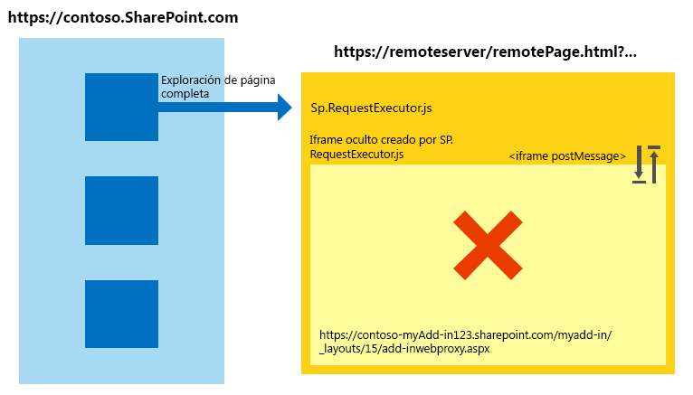
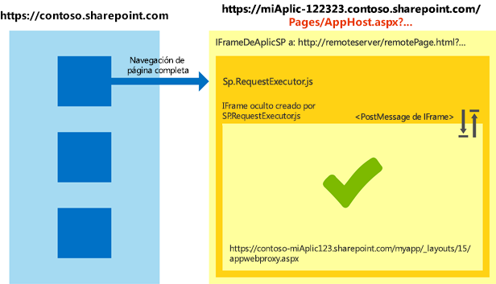

# Trabajar con la biblioteca entre dominios en diferentes zonas de seguridad de Internet Explorer en los complementos para SharePoint
Aprenda a usar la biblioteca entre dominios en SharePoint 2013 cuando las páginas de complementos y la web de host están en zonas de seguridad diferentes en Windows Internet Explorer.
Si usa la biblioteca entre dominios de SharePoint 2013 para sus complementos, debe saber cómo funcionan las zonas de seguridad en Internet Explorer. Su complemento puede encontrarse con algunos problemas de comunicación si el sitio web de SharePoint y el complemento están en diferentes zonas. En este artículo se explica lo que ocurre cuando se usa la biblioteca entre dominios en diferentes zonas de seguridad de Internet Explorer.
  
    
    


## Escenarios entre zonas en Internet Explorer con la biblioteca entre dominios de SharePoint
<a name="bk_crosszonescenarios"> </a>

Por razones de seguridad, Internet Explorer impide que las páginas que se encuentran en niveles de integridad diferentes (también conocidos como zonas de seguridad) compartan cookies galletas porque cada nivel de integridad tiene su propio almacén de cookies. El nivel de integridad de una página está determinado por su página superior y todos los marcos dentro de esa página compartirán el mismo nivel de integridad. Para más información, vea  [Cuidados al compartir cookies en escenarios entre zonas](http://blogs.msdn.com/b/ieinternals/archive/2011/03/10/internet-explorer-beware-cookie-sharing-in-cross-zone-scenarios.aspx).
  
    
    
La biblioteca entre dominios de SharePoint usa un **IFrame** oculto y una página proxy de cliente hospedada en SharePoint para permitir la comunicación del cliente con JavaScript. La biblioteca entre dominios está disponible cuando hace referencia al archivo sp.requestexecutor.js en sus páginas. Para obtener más información, vea [Cómo obtener acceso a los datos de SharePoint 2013 desde aplicaciones con la biblioteca entre dominios](access-sharepoint-2013-data-from-add-ins-using-the-cross-domain-library.md).
  
    
    
Cuando la página del complemento remoto y el sitio web de SharePoint están en zonas de seguridad diferentes, no se pueden enviar cookies de autorización. Si no hay ninguna cookie de autorización y el **IFrame** trata de cargar la página proxy, se le redirigirá a la página de inicio de sesión de SharePoint. Por razones de seguridad, la página de inicio de sesión de SharePoint no puede estar dentro de un **IFrame**. En estos escenarios, la biblioteca no puede cargar la página proxy y no es posible la comunicación con SharePoint.
  
    
    
El siguiente diagrama muestra un escenario entre zonas en las que no se puede cargar la página proxy. La página superior pone el marco en la misma zona de seguridad que  `http://remoteserver/remotepage.html`. La página proxy no se carga.
  
    
    

**Figura 1. Escenario entre zonas donde no se puede cargar la página proxy**

  
    
    

  
    
    

  
    
    
Los siguientes son algunos ejemplos en que la biblioteca entre dominios no puede cargar la página proxy:
  
    
    

- Sus clientes usan SharePoint Online y su página del complemento remoto está hospedada en un servidor de intranet. Este escenario es propenso a la emisión de un problema de carga de la página proxy porque la dirección URL de SharePoint Online normalmente no está en la zona de la intranet local. Este es un escenario muy común durante el desarrollo inicial de un complemento porque puede que esté usando IIS Express u otro servidor local para hospedar la página sin un dominio de Internet completo.
    
  
- Sus clientes usan en SharePoint local con autenticación basada en formularios y su página remota está hospedada en un servicio en la nube (por ejemplo, Microsoft Azure).
    
  

## Controlar escenarios entre zonas en Complementos de SharePoint
<a name="bk_handlingcrosszone"> </a>

Hay un par de maneras (muy recomendadas) de solucionar este problema durante el desarrollo de complementos y el tiempo de ejecución del complemento.
  
    
    

### Procedimiento recomendado: usar el patrón apphost

Para controlar un escenario entre zonas, se recomienda que tenga una página apphost en SharePoint. La página apphost es una página de SharePoint que contiene la página remota en un **IFrame**. Todo dentro del **IFrame** en la página apphost se encuentra en la misma zona de seguridad que la web de complemento. La biblioteca entre dominios de la página remota puede recibir las cookies de autorización y carga correctamente la página proxy.
  
    
    
El siguiente diagrama muestra un escenario entre zonas que se controla con el patrón de la página apphost. 
  
    
    

**Figura 2. Control de escenario entre zonas con el patrón de páginas apphost**

  
    
    

  
    
    

  
    
    
El código necesario para la página apphost es simple. La parte principal de la página apphost es un elemento **SPAppIFrame**. Debe usar CSS para hacer invisible el **IFrame** y que no interfiera con su complemento.
  
    
    
El siguiente marcado es una página apphost de ejemplo. El marcado realiza las siguientes tareas:
  
    
    

- Declara las directivas necesarias para usar componentes de SharePoint.
    
  
- Declara los estilos para hacer invisible el **IFrame**.
    
  
- Declara el **SPAppIFrame** y establece el destino a la página de inicio del complemento.
    
  


```HTML

<%@ Page
    Inherits="Microsoft.SharePoint.WebPartPages.WebPartPage, Microsoft.SharePoint, Version=15.0.0.0, Culture=neutral, PublicKeyToken=71e9bce111e9429c" 
    language="C#" %>
<%@ Register 
    Tagprefix="SharePoint" 
    Namespace="Microsoft.SharePoint.WebControls" 
    Assembly="Microsoft.SharePoint, Version=15.0.0.0, Culture=neutral, PublicKeyToken=71e9bce111e9429c" %>
<%@ Register 
    Tagprefix="Utilities" 
    Namespace="Microsoft.SharePoint.Utilities" 
    Assembly="Microsoft.SharePoint, Version=15.0.0.0, Culture=neutral, PublicKeyToken=71e9bce111e9429c" %>
<%@ Register 
    Tagprefix="WebPartPages" 
    Namespace="Microsoft.SharePoint.WebPartPages" 
    Assembly="Microsoft.SharePoint, Version=15.0.0.0, Culture=neutral, PublicKeyToken=71e9bce111e9429c" %>

<html>
<head>
    <title>Your add-in page title</title>
    <style type="text/css">
        html, body
        {
            overflow:hidden;
        }
        
        body
        {
            margin:0px;
            padding:0px;
        }
         
        iframe 
        {
            border:0px;
            height:100%;
            width:100%;
        }
    </style>
</head>

<body>
    <SharePoint:SPAppIFrame 
        runat="server" 
        src="~remoteAppUrl/StartPage.html?{StandardTokens}" 
        frameborder="0">
    </SharePoint:SPAppIFrame>
</body>
</html>
```

Si desea que los usuarios tengan un gran vínculo con partes de su complemento, la página apphost y el contenido del **IFrame** pueden colaborar para hacerlo posible. Una alternativa es usar una comunicación posterior al mensaje de **IFrame** y direcciones URL individual por página en el complemento remoto. Para tener direcciones URL individuales por página, puede crear páginas individuales en el complemento web o usar parámetros de cadena de consulta en una página.
  
    
    

### Enfoque alternativo: agregar los sitios a la misma zona de seguridad en Internet Explorer.

Si un complemento no se diseñó siguiendo el patrón apphost, todavía puede permitir que trabaje agregando los siguientes dominios en la misma zona de seguridad: 
  
    
    

- El dominio de su sitio de SharePoint (por ejemplo,  `https://contoso.sharepoint.com`).
    
  
- El dominio del complemento hospedado en la nube ( `http://remoteserver`).
    
  
- El dominio de los servicios y las páginas de inicio de sesión hospedadas en Microsoft ( `*.microsoftonline.com`).
    
  
Los administradores pueden usar directivas de Active Directory para publicar los cambios en todos los equipos de la organización.
  
    
    

## Implicaciones de seguridad al usar el patrón apphost
<a name="bk_securityimplications"> </a>

Es importante destacar que el patrón apphost pone efectivamente su página remota en la misma zona de seguridad que el complemento web. Asegúrese de comprender las implicaciones de agregar un sitio a una zona de seguridad. Para más información, vea  [Cómo usar las zonas de seguridad en Internet Explorer](http://support.microsoft.com/kb/174360/es-es).
  
    
    

## Trabajar con otros exploradores: Chrome, Firefox y Safari
<a name="bk_otherbrowsers"> </a>

Otros exploradores como Google Chrome, Mozilla Firefox y Apple Safari, no implementan el concepto de zona de seguridad. Si un explorador no aísla las cookies en almacenamientos independientes, probablemente no encontrará las dificultades descritas en este artículo. Se recomienda que siga el patrón apphost en sus complementos. Con el patrón apphost se asegura que su complemento funciona en Internet Explorer y en los exploradores mencionados, independientemente de qué zona de seguridad de SharePoint se encuentre.
  
    
    

## Recursos adicionales
<a name="bk_addresources"> </a>


-  [Acceso a datos seguro y modelos de objetos de cliente para complementos de SharePoint](secure-data-access-and-client-object-models-for-sharepoint-add-ins.md)
    
  
-  [Cómo obtener acceso a los datos de SharePoint 2013 desde aplicaciones con la biblioteca entre dominios](access-sharepoint-2013-data-from-add-ins-using-the-cross-domain-library.md)
    
  
-  [Complementos de SharePoint](sharepoint-add-ins.md)
    
  
-  [Autorización y autenticación de complementos de SharePoint](authorization-and-authentication-of-sharepoint-add-ins.md)
    
  
-  [Tres formas de concebir las opciones de diseño de complementos para SharePoint](three-ways-to-think-about-design-options-for-sharepoint-add-ins.md)
    
  
-  [Aspectos importantes del panorama de desarrollo y arquitectura de los complementos para SharePoint](important-aspects-of-the-sharepoint-add-in-architecture-and-development-landscap.md)
    
  
-  [Hospedar webs, webs de complementos y componentes de SharePoint en SharePoint 2013](host-webs-add-in-webs-and-sharepoint-components-in-sharepoint-2013.md)
    
  
-  [Almacenamiento de datos en complementos de SharePoint](important-aspects-of-the-sharepoint-add-in-architecture-and-development-landscap.md#Data)
    
  
-  [Crear una página de proxy personalizada para la biblioteca entre dominios en SharePoint 2013](create-a-custom-proxy-page-for-the-cross-domain-library-in-sharepoint-2013.md)
    
  
-  [Seguridad entre dominios del lado cliente](http://msdn.microsoft.com/es-es/library/cc709423%28vs.85%29.aspx)
    
  

